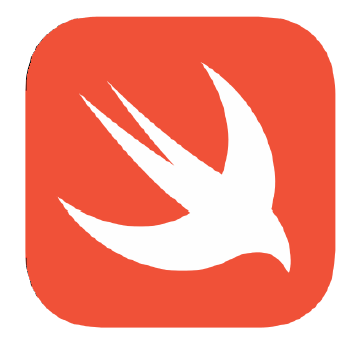
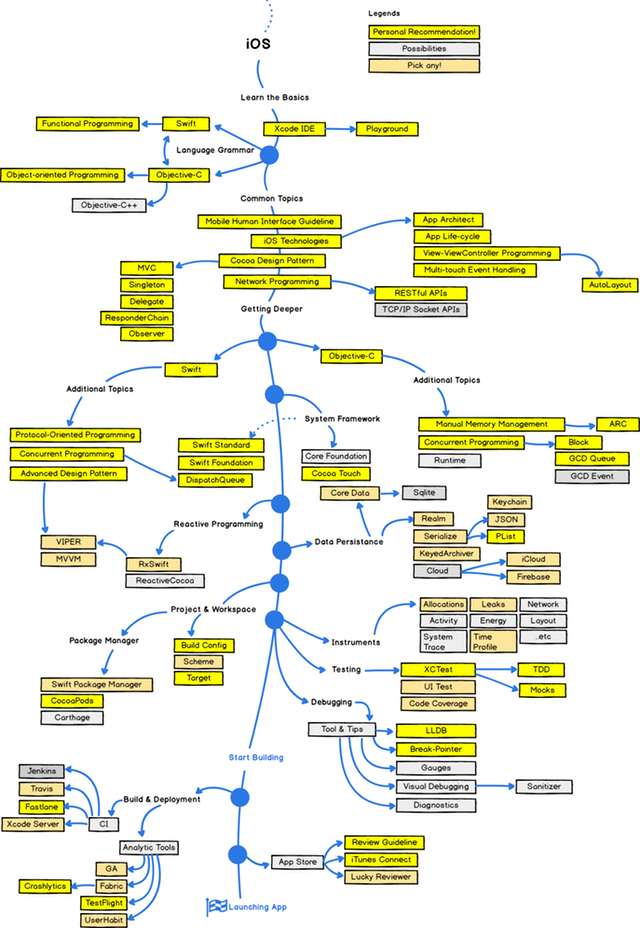

# Swift

> A powerful open language that lets everyone build amazing apps.

**Safe, Fast, Expressive**

~~스위프트 테일러가 자꾸 검색된다~~

기존 Objective-C의 단점을 보완한 애플의 신규 언어체계입니다. 기존 Objective-C에 비해 클로저, 다중 리턴 타입, 네임스페이스, 제네릭스, 타입 인터페이스 등 Objective-C에는 없었던 현대 프로그래밍 언어가 갖고 있는 기능을 많이 포함시켰으며, 이에 따라 일정한 성능 향상을 보이고 있습니다. (이름 뜻도 빠르다는 의미입니다.) 애플이 만든 언어답게 iOS와 macOS를 대상으로 합니다.

## Table of Contents

#### - Basic
- Data
  - [변수와 상수](./basic/var_let.md)
  - [Swift Standard Library 자료형](./basic/standard.md)
    - [기본 자료형](./basic/basic_type.md)
    - [컬렉션 자료형](./basic/collection_type.md)
    - 기본 프로토콜
      - [Encoding, Decoding, and Serialization](./basic/codable.md)
      - [Equality and Ordering](./basic/equatable.md)
      - [Hash for Sets and Dictionaries](./basic/hashable.md)
      - [Sequence and Collection](./basic/sequence.md)
  - [Swift Type System (Named vs. Compound)](./basic/types.md)
    - Named Types
      - [protocol](./basic/protocol.md)
      - [enum](./basic/enum.md)
      - [struct](./basic/struct.md)
      - [class](./basic/class.md)
    - Compound Types
      - [tuple](./basic/tuple.md)
      - [function type](./basic/function.md)
        - [function](./basic/func.md)  
        - [method](./basic/method.md)
        - [closure](./basic/closure.md)
  - 기타
    - [Generics](./basic/generics.md)
    - [Properties](./basic/properties.md)
  - [Value types vs. Reference types](./basic/value_vs_reference.md)

- Instructions
  - [기본 연산자](./basic/basic_operator.md)
  - [반복문](./basic/loop.md)
  - [분기문](./basic/condition.md)

- Application
  - [File system](./basic/file.md)
    - [Bundle](./basic/bundle.md)
  - [Life Cycle](./basic/lifecycle.md)
  - [States](./basic/appstate.md)

- [Access Control (접근제어자)](./basic/access.md)

#### - Features
> 초기 Swift의 특징은 Fast, Modern, Safe, Interactive이었으나, 이후 Safe(안정성), Fast(신속성), Expressive(표현성)로 바뀌었습니다.

- Safe
  - [Optional](./features/optional.md)
  - [Error handling](./features/error_handling.md)
  - [기타](./features/safe.md)

- Fast
  - [LLVM & Clang](./features/fast.md)

- Expressive
  - [POP (Protocol Oriented Programming)](./features/pop.md)
  - [Functional Programming](./features/functional_programming.md)
    - [First-Class Functions](./features/first_class_functions.md)
    - [Higher-Order Functions](./features/higher_order_functions.md)
    - [Functor](./features/functor.md)
    - [Monad](./features/monad.md)

#### - Frameworks
  - [About (Library / Frameworks / API / 아키텍쳐 / SDK)](./frameworks/about.md)
  - Frameworks
    - UI
      - [UIView](./frameworks/view.md)
        - [View vs. Layer](./frameworks/view_vs_layer.md)
      - [UIViewController](./frameworks/vc.md)
    - Core Animation
      - [CALayer](./frameworks/calayer.md)
    - Media
      - [Video](./frameworks/video.md)
        - [Buffer](./frameworks/buffer.md)
        - [Real time](./frameworks/realtime.md)
        - [Trim & Merge](./frameworks/trimMergeVideo.md)
        - [Save](./frameworks/saveVideo.md)
      - Image
        - [UIImage/CIImage/CVImage](./frameworks/image.md)
      - [Audio](./frameworks/audio.md)
        - [AVAudio Session Programming](./frameworks/audio_session.md)
        - [AVAudioEngine과 AVAudio Player, Recorder 차이](./frameworks/audio_difference.md)
        - [AVAudio preferred Input, Output](./frameworks/audio_input_output.md)
        - [AVAudioSession Port Type](./frameworks/audio_port.md)
    - Data Management
      - Core Database
      - SQLite
    - [AR](./frameworks/arkit.md)
      - [ARSession, ARConfiguration](./frameworks/arsession.md)
      - ARKit2
        - [Saving and Loading Maps](./frameworks/save_load_maps.md)
        - [Environment Texturing](./frameworks/environment_texturing.md)
        - [Image Tracking](./frameworks/image_tracking.md)
        - [Object Detection](./frameworks/object_detection.md)
        - [Face Tracking Enhancements](./frameworks/face_tracking_enhancements.md)
    - [CoreML](./frameworks/coreml.md)
    - [Sirikit](./frameworks/sirikit.md)
      - [Shortcut](./frameworks/siri_shortcut.md)

#### - Additional Topics
- Performance Management
  - [Performance Improvement](./additional_topics/performance_improvement.md)
    - [Method Dispatch (Static vs Dynamic)](./additional_topics/method_dispatch.md)
      - Swizzling
  - WMO (Whole Module Optimization)

- Memory Management
  - [Memory Allocation](./additional_topics/allocation.md)
  - [ARC](./additional_topics/arc.md)
  - [AutoReleasePool](./additional_topics/autoreleasepool.md)
  - [Memory Safety](./additional_topics/memory_safety.md)

- Concurrent Programming
  - [About](./additional_topics/concurrent.md)

  - [Thread Safe in Swift](./additional_topics/threadsafe.md)

  -  MultiThread 기법
      - [Thread](./additional_topics/thread.md)
      - [OperationQueue](./additional_topics/operationQueue.md)
      - [GCD](./additional_topics/GCD.md)
        - [OperationQueue vs. DispatchQueue](./additional_topics/operation_vs_gcd.md)

- Reactive Programming
  - [RxSwift](./additional_topics/rxswift.md)

#### - Networking
- [Networking Overview: Network Layer](./networking/overview.md)
- Networking in Swift: URLs, URLRequests and URLSessions
- [HTTP, HTTPS/ HTTP/2 Request: RESTful API](./networking/restful.md)
- [Message Oriented protocols & Stream protocols](./networking/message_stream.md)
- Handling Response: Parsing & Mapping Data

#### - Security

- [Security Overview](./security/overview.md)
- Authorization & Authentication
- Secure Data
- [Cryptography](./security/cryptography.md)

#### - Pattern

- Design Pattern

  - [원칙 (SOLID)](./pattern/solid.md)
    - [단일 책임: SRP](./pattern/srp.md)
    - [개방-폐쇄: OCP](./pattern/ocp.md)
    - [리스코프 치환: LSP](./pattern/lsp.md)
    - [인터페이스 분리: ISP](./pattern/isp.md)
    - [의존성 역전: DIP](./pattern/dip.md)

  - Type

    - [Architecture Pattern](./pattern/architecture.md)
      - [MVC](./pattern/mvc.md)
      - [MVVM](./pattern/mvvm.md)
      - [MVP](./pattern/mvp.md)
      - [VIPER](./pattern/viper.md)

    - [Swift에서 객체간 (비동기) 소통 패턴 - (Delegate / Notification / Callback / Observable)](./pattern/object.md)

    - 생성 패턴 (추상 객체 인스턴스화)
      - 추상 팩토리
      - 팩토리
      - 빌더
      - 프로토타입
      - 싱글톤
    - 구조 패턴 (객체 결합)
      - 어댑터
      - 브리지
      - 컴포지트
      - 데코레이터
      - 파사드
      - 플라이웨이트
      - 프록시
    - 행위 패턴 (객체간 소통)
       - 책임 체인
       - 커맨드
       - 인터프리터
       - 반복자
       - 중재자
       - 메멘토
       - 옵저버
       - 상태
       - 전략
       - 템플릿 메소드
       - 방문자

- Human Interface Guide

#### - Maintenance

- 좋은 유지보수를 위한 설계
  - [스파게티 코드](./maintenance/spa_code.md)
  - [가치와 원칙](./maintenance/principle.md)
  - [인터페이스 설계: CRUD](./maintenance/crud.md)
- Swift Convention
  - [Swift API Design Guidelines](./maintenance/api_design_guideline.md)
  - [Naming Convention](./maintenance/naming_convention.md)
  - [Swift Lint Library](./maintenance/lint.md)
- Testing
  - TDD
  - BDD
- Debugging
- Profiling

#### - Etc.
- [Face Recognition 기법들](./etc/face.md)

### 2018 Roadmap to iOS Development

