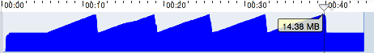

# AutoReleasePool

## Swift의 기본적 메모리 관리: ARC

 low-level 언어들은 일반적으로 alloc-free 방식 메모리 관리 정책을 이용합니다. 매우 단순한데, 사용할 메모리를 할당(Allocation) 하는 것이 alloc 이고 반대로 이 할당한 메모리를 다시 OS에 돌려주는 것이 free입니다.


 Swift 이전의 Object-C는 C에서 파생된 언어이기 때문에 C의 이런 메모리관리 방식을 그대로 사용할 수 있지만, 그 보다는 좀 진보한 메모리 관리 정책을 도입하였습니다. 바로 레퍼런스 카운트 개념을 이용한 메모리 해제 방법입니다.

 레퍼런스 카운트 방식은 Retain과 Release 라는 개념을 이용합니다. 메모리를 할당(alloc)하는 것은 비슷하지만, 코드에서 메모리를 참조하려 할 때 이 레퍼런스 카운트를 증가(retain)시키고 참조가 끝나면 레퍼런스 카운트를 감소(release)시키는 방식이다. 그래서 레퍼런스 카운트가 0이 되면 메모리가 해제(free)됩니다. 따라서 레퍼런스 카운트 메모리 관리 방식에서는 '리테인 하는 코드'와 '릴리즈 하는 코드'가 쌍으로 존재해야 합니다.

~~리테인은 '내꺼라고 침 뱉는 행위', 그리고 릴리즈는 이제 필요없으니 '뱉어놓은 침을 닦는 행위'라고 종종 이야기합니다.~~

retain과 release가 짝이 잘 맞으면 레퍼런스 카운트 방식의 메모리 관리 방법은 잘못된 메모리 참조 오류를 일으킬 가능성이 낮아지면서도 GC(자동 메모리 회수, Gabage Collection)에 의한 퍼포먼스 저하도 존재하지 않는 효율적인 방식이 됩니다.

> GC의 대표적 부작용 2가지

-  1. GC가 언제 실행될 지 코드 상에서 알 수가 없습니다.

-  2. GC로 인한 퍼포먼스 저하  

이러한 retain/release의 ARC를 스위프트 코드로 개념적으로만 설명하면 아래와 같습니다.

```swift
// 예제 코드
func someFunction() {
    var obj = SomeClass()
    doWork(obj)
}

// 위 코드는 빌드 시 ARC에 의해 아래와 같은 식으로 바뀌어져 컴파일됩니다.
// 다만 아래 코드는 개념 설명을 위한 코드이므로 빌드는 안 될 것입니다.
func someFunction() {
    var obj = SomeClass()
    obj.retain()       // ARC

    doWork(obj)

    obj.release()      // ARC
}
```

Swift는 strong, weak, unowned의 세 가지 방법중 하나를 골라 ARC에게 retain/release 처리 방법을 알려줄 수 있습니다. 자세한 내용은 [ARC](./arc.md)를 참조하시면 됩니다.


기존에는 개발자가 객체 release 시점과 적용해야 하는 대상 객체, 그리고 Ref Count 등에 대해 정확히 이해하고 관리해야 했으나 ARC가 자동으로 이를 관리하여 주기 때문에 세세하게 신경써야 할 필요가 사라졌습니다. 그러나 이러한 ARC와 더불어 특수한 상황에서 추가적으로 메모리 관리에 필요한 개념이 **AutoRelease**입니다.

## AutoRelease

AutoRelease는 참조 카운트를 나중으로 미루기 위한, 그러면서도 카운트가 나중에 감소되는 것을 보장받기 위한 기법입니다. 객체의 참조 카운트를 감소시킬 때 release대신 autorelease를 사용하면 release가 예약된다. 실제 release를 수행하면 참조 카운트가 바로 줄어들지만, autorelease 직후는 아직 release된 상황이 아니므로 참조 카운트가 감소되지 않습니다. (물론 나중에는 감소합니다). ~~그런데 왜 이름이 reserveRelease가 아니고 autoRelease인지..~~

autoRelease된 객체는 **AutoReleasePool**에 등록됩니다. AutoReleasePool은 객체를 관리하는 일종의 컬렉션입니다. 그리고 이 컬렉션이 해제될 때 관리하는 객체를 모두 release합니다. 따라서 autorelease 된 객체의 release 시점은 아주 명료합니다. 바로 AutoReleasePool은이 해제될 때입니다.

당연히 사용가능한  AutoReleasePool이 없다면 autoRelease객체는 release 메시지를 받지 못하고 메모리 누수가 발생하게 됩니다. 따라서 AutoReleasePool이 없는 상황에서 autoRelease 메시지를 보내면 코코아는 에러를 띄울 것 입니다. 앱킷이나 UI킷 프레임워크는 각각의 이벤트 루프의 시작점에서 자동적으로 AutoReleasePool을 생성하여 작동합니다.

그러나 원하면 각종 컬렉션 객체를 이용하여 별도의 pool을 간단하게 만들어 쓸 수도 있습니다. 다만, Foundation Framework에 AutoreleasePool이 있으므로 일반적으로 애써 만들 이유는 없습니다. 하지만 다음의 경우에는 별도의 AutoreleasePool을 만들어야 합니다.

> 1. 코코아 애플리케이션의 각 스레드는 자체적인 자동 릴리스 풀 블록 스택을 유지합니다. 그러나 Foundation-only 프로그램의 경우 자체적인 오토릴리즈 풀을 만들어야 합니다.

> 2. 많은 양의 임시 객체를 사용하는 루프를 쓸 때. 만약 루프 안에서 임시 객체를 만들어 쓸 때 루프 속에 오토릴리즈 풀을 만들면 이는 루프를 돌면서 사용하는 메모리의 최대치를 낮게 제어할 수 있습니다.

> 3. 다른 스레드를 만들어 분리하는 경우, 오토릴리즈 풀을 생성합니다. 스레드가 실행되면 가능한 먼저 오토스레드 풀을 만들어야 합니다. 그렇지 않으면 메모리가 누수될 여지가 생깁니다.

오토릴리즈 풀은 생성된 루프나 함수 내에서 폐기 되어야 합니다. 또한 객체의 인스턴스 변수에 대해서는 오토릴리즈 풀을 생성할 필요도 없고, 보통 하지도 않습니다.

때문에 일반적으로 오토릴리즈 객체는 **함수 내부에서 생성되어 리턴되는 객체를 위한 메모리 트릭**이라고 볼 수 있습니다. 아래는 함수 내에서 여러 개의 UIImage를 만드는 스위프트 예시입니다.

```swift
func useManyImages() {
    let filename = pathForResourceInBundle

    for _ in 0 ..< 5 {
        for _ in 0 ..< 1000 {
            let image = UIImage(contentsOfFile: filename)
        }    
    }
}
```

이러한 함수를 돌릴 경우, 함수 시작과 끝에서 retain/release가 일어나기 때문에 프로그램 메모리 allocation graph가 아래와 같이 함수 종료 직전까지 상승하게 됩니다.


때문에 만약 함수 내에서 수 없이 많은 이미지 객체를 루프를 통해 생성하는 경우, 메모리로 인해 앱이 죽는 상황까지 발생할 수 있습니다.

그러나 함수 내에서 루프를 돌 때마다 명시적으로 오토릴리즈 풀을 이용해 메모리를 해제할 수 있습니다. 아래는 위의 예시를 오토릴리즈 풀을 이용하여 쓴 코드입니다.

```swift
func useManyImages() {
    let filename = pathForResourceInBundle

    for _ in 0 ..< 5 {
      autoreleasepool {
        for _ in 0 ..< 1000 {
            let image = UIImage(contentsOfFile: filename)
        }   
      }
    }
}
```
오토릴리즈 풀의 블락이 종료됨과 동시에 풀 안의 오토릴리즈 객체들의 메모리는 모두 해제됩니다. 따라서 위의 코드를 돌린 메모리 할당 그래프는 아래와 같습니다.




### Reference:
- http://nephilim.tistory.com/120
- https://stackoverflow.com/questions/25860942/is-it-necessary-to-use-autoreleasepool-in-a-swift-program
- http://blog.naver.com/PostView.nhn?blogId=itperson&logNo=220819529932&parentCategoryNo=&categoryNo=72&viewDate=&isShowPopularPosts=false&from=postView
