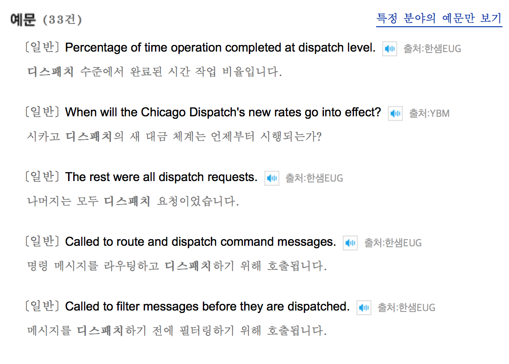
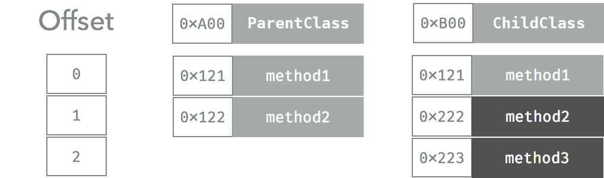
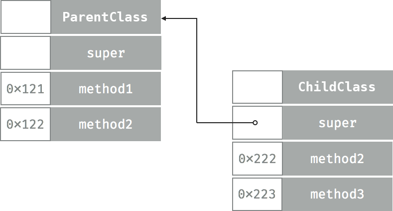
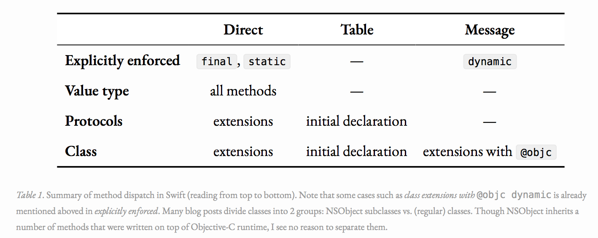

# Method Dispatch

## Dispatch란?



~~디스패치 뉴스말고~~ 디스패치의 뜻을 사전 조회해 보면 "보내다"라는 의미임을 알 수 있습니다. (그런데 예문은 다 디스패치를 디스패치라고 해석합니다. ~~딘딘은 딘딘~~)

어디선가 들어본 기억이 있으실텐데 CPU 스케쥴링에서 역시 디스패치 용어를 사용합니다. 컴퓨터과학에서 디스패치란 준비 상태에서 실행 상태로 전이되는 과정을 말합니다. CPU 스케쥴링에서는 작업 스케쥴러가 준비 중인 프로세스를 선택하여 실행하고 해당 프로세스가 CPU를 점유하도록 하는 과정을 말하였습니다.


~~숨은 dispatch 찾기~~

이러한 디스패치의 뜻을 생각하면 Method Dispatch에 대해 쉽게 이해할 수 있을 것 같습니다. Method Dispatch 란 쉽게 말해 **준비 중인 메서드를 호출하여 실행**하는 것입니다. Dispatch의 목표는 프로그램에서 특정 메서드 호출의 실행 코드를 찾을 수 있는 메모리 위치를 CPU에 알려주는 것입니다.

이러한 Method Dispatch를 실행하는 방법에는 크게 Static한 방법과 Dynamic한 방법 두 가지를 말할 수 있습니다.

## 1. Static Method Dispatch

Static. 즉, 정적인 방식으로 준비 중인 메서드를 호출하여 실행합니다. 호출될 메서드는 컴파일 타임에 미리 정해져 있기 때문에 미리 호출될 준비를 마친 상태입니다. 때문에 런타임에서 direct하게 함수를 call할 수 있기 때문에 상대적으로 속도가 빠르고 효과적입니다. 컴파일 시에 디스패치가 이루어지기 때문에 **compile time dispatch**라고도 불리며, 런타임 시에 direct하게 메모리 주소로 가서 해당 함수를 호출하기 때문에 **direct dispatch**라고도 불립니다. 이러한 메소드 코드가 저장된 메모리 위치는 런타임 동안 절대 변하지 않기 때문에 direct하게 접근이 가능합니다.

그러나 이러한 Static 방식의 디스패치는 프로그래밍 관점에서 가장 제한적이며, subclassing을 지원할 만큼 동적이지 못합니다. (이러한 다형성 지원을 위하여 Dynamic Method Dispatch가 존재합니다.) 하지만, 빠르고 퍼포먼스 측면에서 많은 이점이 있기 때문에 가장 선호되는 방식입니다. 컴파일러가 가능한 한 메소드를 static하게 바꾸려고 최적화의 노력을 하는 것을 devirtualization이라고 합니다.


## 2. Dynamic Method Dispatch

Dynamic. 즉, 동적인 방식으로 준비 중인 메서드를 호출하여 실행합니다. 컴파일 타임에 호출될 메서드가 정해져 있지 않고, 인터페이스를 이용하여 호출되는 메서드가 런타임 도중 동적으로 정해집니다. 런타임 때에 디스패치가 이루어지기 때문에 **runtime dispatch**로도 불립니다. Static 방식보다 느리지만 **OOP컨셉에서 다형성 개념**을 구현할 수 있도록 해줍니다.  스위프트에서는 2가지 형태의 Dynamic Method Dispatch를 지원합니다.

### 2.1 Table Dispatch

Compiled Language에서 가장 흔하게 쓰이는 방법입니다. Table Dispatch는 클래스 안의 각각의 메소드에 대해 포인터 배열을 사용합니다. 스위프트에서는 이 것을 "witness table"이라고 부릅니다. 모든 subclass는 클래스가 override 한 모든 메소드에 대해 각각의 포인터를 가지고 있는 고유한 테이블 복사본을 가지고 있습니다. 이러한 테이블은 컴파일 시에 만들어집니다. 이 테이블은 런타임 시에 참조되고 실행할 메소드가 결정됩니다. 함수 호출을 virtual table (witness table)를 참고 하여 virtual method call방식이라고 부르기 때문에 **virtual dispatch**라고도 부릅니다.

```swift
class ParentClass {
    func method1() {}
    func method2() {}
}
class ChildClass: ParentClass {
    override func method2() {}
    func method3() {}
}
```

위의 두 가지 클래스를 가지고 예시를 들 수 있을 듯 합니다. 이 예시에서 컴파일러는 ParentClass와 ChildClass, 두 가지 클래스에 대해 각각의 dispatch table을 생성합니다.



```swift
let obj = ChildClass()
obj.method2()
```

메소드가 호출될 경우, 프로세스는 다음과 같습니다.

1. OxB00 객체에 대한 디스패치 테이블을 읽습니다. (Read)

2. 해당 메소드에 대한 인덱스의 포인터를 읽습니다. 이 경우, function2에 대한 인덱스가 1이므로 OxB00 + 1의 주소를 읽어옵니다. (Read)

3. 0x222 주소로 이동합니다. (Jump)

이러한 Table Lookup은 매우 단순하고 예측 가능하지만, Static (Direct) Dispatch에 비해 느리다는 단점이 존재합니다. 바이트 코드 관점에서, 두 개의 추가적인 읽기 및 점프가 있으며, 이는 약간의 오버헤드를 유발합니다. 그러나 이러한 방법이 느린 것으로 간주되는 또 다른 이유는 컴파일러가 방법 내에서 발생하는 작업에 따라 최적화를 수행할 수 없기 때문입니다.

### 2.2 Message Dispatch

Message Dispatch는 호출에 있어서 가장 Dynamic한 방법을 제공합니다. 그러나 pure Swift의 한 부분인 table dispatch 와는 다르게 message dispatch는 cocoa environments에서만 지원됩니다. 이 디스패치 방법을 가능하게 하는 것은 Object-C이며, Swift 코드는 이 디스패치를 위하여 Object-C 런타임 lib을 사용합니다. Object-C 메서드가 호출될 때마다 호출은 룩업을 처리하는 objc_msgSend로 전달됩니다. 주어진 클래스로부터 프로세스를 시작하여 클래스 계층을 iterate함으로써 구현합니다.

table dispatch와 다르게 message passing dictionary는 런타임 시에 수정될 수 있습니다. swizzling으로 함수 호출을 변경할 수 있을 뿐만 아니라 isa-swizzling으로 객체 역시 타 객체로 치환 가능합니다.

message dispatch는 KVO, UIAppearance, Core Date 등의 특징을 가능하게 합니다. KVO 등이 이러한 swizzling을 구현하고 있습니다.


>  Method Swizzling은 원래의 메소드를 runtime 때 원하는 메소드로 바꾸어 사용할 수 있도록 하는 기법입니다. 원하는 메소드로 바꾸어 사용하게 되면 메소드를 호출하기 전에 사용자 추적, 특정 기능 수행들을 할 수 있는 이점이 있지만, 임의로 바꾸었기 때문에 버그가 발생할 수 있습니다.

```swift
class ParentClass {
    dynamic func method1() {}
    dynamic func method2() {}
}
class ChildClass: ParentClass {
    override func method2() {}
    dynamic func method3() {}
}
```

위의 예시에 대해 스위프트는 아래와 같이 트리 구조로서 계층 구조를 모델링할 것입니다.



특정 메소드에 대한 디스패치 메시지가 오면, 런타임 때에 클래스 계층 구조를 crawl하여 파악한 후, 어떠한 메소드를 실행할 것인지 계층 구조 내에서 결정합니다. 해당 클래스 내의 모든 메소드의 포인터를 기록하는 테이블 사본만 보면 되는 table dispatch와 비교하였을 때, 클래스 계층 구조를 하나하나 따라가서 호출 할 메소드를 찾는다는 점에서 분명한 차이가 존재합니다.

가장 dynamic하게 디스패치하기 때문에 가장 많은 리소스를 사용하지만 캐싱 메커니즘을 통해 속도를 향상 시킬 수 있습니다. 더불어 물론 속도의 단점이 있지만, 앞서 말한 것 처럼 특정 포인터 사본을 가지고 있는 것이 아니라 계층 구조를 파악한 후 상위 클래스를 참조하여 따라가서 호출할 메소드를 찾기 때문에 앞서 언급한 것 처럼 swizzling으로 함수 호출을 변경할 수 있습니다. ~~물론 참조가 많아진 만큼 버그 발생 가능성은 높아질 것 같습니다.~~


## Compiler Optimization

스위프트 컴파일러는 코드를 인간 친화적인 형태에서 기계 친화적인 형태로 변환하고 그 과정에서 코드를 최적화하여 더 빨리 작동하도록 한다. 메서드 디스패치를 위해 더 빠른 형식인 static dispatch를 선호합니다. 컴파일러가 컴파일할 때 특정 메서드가 참조될 것을 확신할 수 있는 경우 컴파일러는 이를 가상화(devirtualize)하거나 인라인(inline)으로 전환할 수 있습니다.

> devirtualize는 virtual method call을 direct method call로 전환하는 일반적인 컴파일러 Optimization 방법입니다.

> inline은 direct method call을 inline 메소드로 전환하는 일반적인 컴파일러 Optimization 방법입니다.


## Method Dispatch in Swift

Swift 내에서 Method Dispatch 가 쓰이는 일반적인 케이스를 정리한 표입니다. (계속 변할 수 있습니다.)



Swift는 클래스가 superclass에 선언된 메소드나 properties를 override 할 수 있게 허용합니다. 이는 프로그램이 런 타임에 어떤 메소드나 프로퍼티가 참조되어야 하는지, 그리고나서 간접적 호출 혹은 간접적 접근을 해야하는 지 결정해야 함을 의미합니다. (dynamic dispatch) 당연히 이러한 상속은 클래스에만 적용되고 value type에는 적용되지 않기 때문에 value type은 모두 static (direct) dispatch만 사용합니다.

@objc는 해당 코드(class, method, property, etc.)가 Objective-C 로부터 Visible하게 만들어준다는 의미입니다. 버튼이나 제스쳐 recognizer 등의 타겟/액션 등에 사용하여야 합니다.

dynamic은 Objective-C의 dynamic dispatch (message dispatch)를 사용하고 싶다는 의미입니다. KVO support나 method swizzling을 위하여 사용할 수 있습니다.

> swift4 이전의 버젼에서는 dynamic이 @objc를 자동으로 내포하였으나 swift4부터는 dynamic dispatch에 대한 의미만을 내포하고 Objective-C visibility의 의미는 더이상 내포하지 않습니다. 그러나 Swift에서의 message dispatch는 반드시 Objective-C 런타임의 message dispatch를 활용하기 때문에 반드시 @objc dynamic이라고 명시해야 합니다.


```swift
class ToObjcOrNotObjc {
  func performOperation() -> Int {
    return 42
  }

  @objc func performOcOperation() -> Int {
    return 42
  }

  @objc dynamic func performDynamicOperation() -> Int {
    return 42
  }
}
```
위의 예시를 1억번 루프 돌렸을 때, 걸리는 시간은 대략적으로 다음과 같습니다.
```
Time for 100000000x performOperation: 0.5983s
Time for 100000000x performOcOperation: 0.5911s
Time for 100000000x performDynamicOperation: 3.3750s
```


## Conclusion

- Static Dispatch의 경우 퍼포먼스 적으로 가장 좋습니다. dynamic language인 Objective-C에 비해 빠른 이유 중 하나입니다. (This is why Swift is swift)

- message dispatch는 퍼포먼스 적으로 좋지 않아 보이지만, 가장 유연하므로 특정 상황에서 높은 사용성을 보일 수 있습니다.

- message dispatch를 이해함으로서 조금 더 optimized한 코드를 작성할 수 있을 뿐만 아니라 몇몇의 버그 발생을 예방할 수 있습니다.


### Reference:

- https://medium.com/@PavloShadov/https-medium-com-pavloshadov-swift-protocols-magic-of-dynamic-static-methods-dispatches-dfe0e0c85509

- https://www.raizlabs.com/dev/2016/12/swift-method-dispatch/

- https://trinhngocthuyen.github.io/2017-09-25-method-dispatch-in-swift.html

- https://swiftunboxed.com/interop/objc-dynamic/
