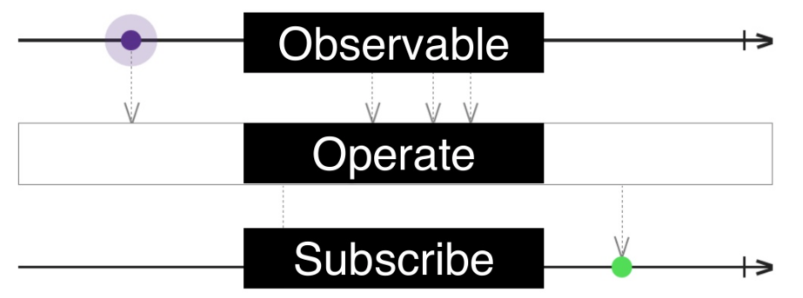

# RxSwift

> RxSwift is a library for composing asynchronous and event-based code by using observable sequences and functional style operators, allowing for parameterized execution via schedulers.

*By Marin Todorov. ‘RxSwift - Reactive Programming with Swift.’ iBooks.*

 <strong>Keywords</strong>:
 observable(관찰가능한), asynchronous(비동기), functional(함수의), via schedulers(스케줄러를 통해)

 다시 표현하자면 다음과 같습니다.
 > 새로운 데이터에 대해 코드가 순차적이며 독립적으로 반응하도록 비동기적 프로그래밍하는 것

이러한 RxSwift의 장점을 정리하자면 다음과 같습니다.

> 1. 다수의 비동기 이벤트에 대해 쉽게 관찰함으로써 기존 객체간 소통 (Delegation, Notification, KVO, Callback 등) 에 비해 데이터 업데이트 / 바인딩 및 이벤트 처리가 용이합니다.

> 2. 이벤트 처리에 있어서 다양한 Operator가 존재합니다. (ex) Map, Merge, TimeInterval 등...)

 > 3. 다수의 비동기 이벤트 처리를 해야하는 경우, 기존보다 용이하게 쓰레드를 관리할 수 있습니다.

 

요약하자면, <strong>"다수의 (비동기) 이벤트에 대해 용이한 쓰레드 관리로 여러 Operator의 형태의 객체간 소통을 지원할 수 있다"</strong> 라고 말할 수 있습니다.

RxSwift는 observer패턴의 확장인 observable이라는 객체를 사용하여 비동기적으로 값을 배출 할수 있고 이러한 1개 혹은 다수의 이벤트를 관찰하고 시퀀스로 반응함으로써 소통합니다.

> <strong> Observeable : </strong>
구독(Subscribe)당하는 오브젝트
이벤트를 시간의 흐름에 따라 전달하는 전달자

> <strong> Observer : </strong>
구독하는 오브젝트, 3가지 이벤트(next, completed, error)에 대해서만 구독 가능

> <strong> Operator : </strong>
 filter, map 등의 연산자, 여러 조합으로 다양한 결과를 도출 가능

 - [Reactive Function을 시각적으로 표현해주는 사이트](http://rxmarbles.com/  )

> <strong> Scheduler : </strong>
Dispatch queue와 비슷

> <strong> Dispose :</strong>
 Observables의 사용이 끝나면 메모리를 해제해야 합니다. 그 때 사용할 수 있는것이 Dispose입니다.

이를 통해서 하나의 방식으로 다수의 비동기 처리가 가능해지기 때문에 객체간 비동기 소통이 매우 편리해 집니다. 즉, NotificationCenter, Delegate, KVO, GCD .. 등.. Observable로 단일화 됩니다. 더불어 비동기 코드를 작성할 때 자주 발생하는 실행 순서가 보장되지 않는다는 것과 Mutable 데이터를 공유하고 있다는 점에 대해 효율적인 접근이 가능합니다.

델리게이트의 수많은 프로토콜과 더이상 부딪히지 않아도 되며, Notification Center보다 더욱 간결하고 명확하게 관찰 가능합니다.

참고: [객체간 (비동기) 소통](../pattern/object.md)

### Reference

- http://reactivex.io/documentation/operators.html
