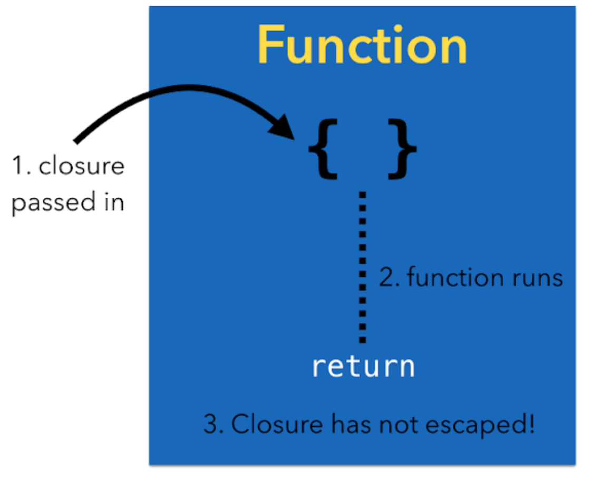
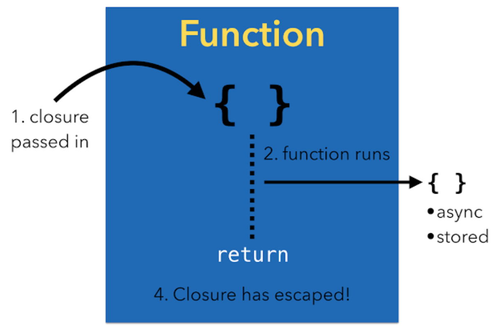

# Closure

함수와 비슷한 기능을 수행하나, **1. 이름이 없고**, 자신이 **2.정의되는 시점에 캡쳐를 통하여 주변환경(context)으로부터 여러 상수와 변수의 값의 참조들을 저장하거나 값 자체를 복사하여 내부적으로 저장**할 수있다는 점에서 차이가 존재합니다. 자신이 정의된 환경을 캡쳐해서 저장한 뒤 닫아버린다고 하여 클로져(closure)라고 부릅니다. Closure는 코드를 간결하고, 직관적으로 작성하는 데 많은 도움을 주는 기능입니다.

일반적인 함수와의 차이점을 생각할 때, 그 차이점을 요약하면 다음과 같습니다.

> Roughly, a closure is a block of code that may **capture** variable values from its surrounding scope.


> Roughly, a function is a statically defined block of code that may **use** variable values from its surrounding scope.

## Closure 기본 형태

클로저는 기본적으로 { (`Parameter`) -> `return type`  **in**  `statements` }의 형식을 취합니다.

애플의 Swift 공식 가이드 문서에서는 Closure를 sorted(by:) 메소드를 통해 설명합니다. sorted(by:) 메소드는 Swift 내장 메소드로 배열을 by 이하의 기준에 따라 정렬하는 메소드입니다. 이 때 그 기준은 배열에 있는 데이터 타입들 간의 대소 비교 를 통해 이뤄집니다. 즉, 배열의 두 값을 가져와 그 크기를 비교하여 앞의 값이 뒤의 값보다 이전에 와야하면 true를 그렇지 않으면 false를 반환하는 것을 반복하고(오름차순 기준) 그 결과에 따라 정렬합니다.

이 때, by에서 필요한 값은 Bool을 반환하는 함수의 형태로, 일반적인 함수 혹은 closure가 들어가게 됩니다. 이에 따라 다음과 같은 형태들이 sorted(by:)의 인자로 들어가게 됩니다.

```swift
let names = ["Chris", "Alex", "Ewa", "Barry", "Daniella"]

func backward(_ s1: String, _ s2: String) -> Bool {
    return s1 > s2
}

var namesWithFunc = names.sorted(by: backward)
var namesWithClosure = names.sorted(by: { (s1: String, s2: String) -> Bool in return s1 < s2 })

// 결과적으로 배열 전체가 내림차순으로 정렬됩니다.
```

위의 경우 namesWithFunc sorted(by:)의 인자를 일반 함수(backward)로 받은 형태이고, namesWithClosure는 sorted(by:)의 인자를 closure로 받은 것입니다.

## Closure는 참조타입

함수와 클로저는 참조 타입입니다. 함수와 클로저를 상수나 변수에 할당할 때 실제로는 상수와 변수에 해당 함수나 클로저의 참조(reference)가 할당 됩니다. 그래서 만약 한 클로저를 두 상수나 변수에 할당하면 그 두 상수나 변수는 같은 클로저를 참조하고 있습니다.

또한 클로저가 매개변수로 값을 넘기는 것이 아닌 단순히 클로저 바깥의 값을 사용할 때는 값을 복사하여 클로저 내부에 저장하고 사용하는 것이 아닌 해당 값의 **참조를 캡쳐** 하여 사용하게 됩니다. 때문에 아래와 같은 예시에서 알 수 있듯이 클로저는 참조되는 값의 변경을 반영합니다.

```swift
var a = 0
var b = 0

// Type explicitly stated
let newClosure: () -> () = { print(a, b) }

// Type inferred
let closure = { print(a, b) }

closure() // 0 0

a = 6
b = 9

closure() // 6 9
```

### 문제점

그러나 특수한 상황에서 이렇게 클로저 내부의 값들이 외부의 값을 참조하는 것이 문제가 될 수 있습니다.

```swift
var index:Int = 0
var closureArr:[()->()] = []

for _ in 1...5 {
    closureArr.append( {print(index)} )
    index += 1
}

for i in 0...4 {
    closureArr[i]()
}
```

원하는 결과는 ```0, 1, 2, 3, 4``` 이지만 실제 결과는 ```5, 5, 5, 5, 5```입니다. 위 코드에서 index가 매개변수로 넘어가는 것이 아니라 외부에 있는 값이며 클로저 내부에서는 해당 변수를 참조하는 것이기 때문에 반복문이 끝나고 최종적으로 index가 5가 되므로 결과값이 ```5, 5, 5, 5, 5```로 나오는 것입니다.

cf) 또 다른 문제점으로는 강한 순환 참조의 캡쳐를 말할 수 있습니다. 이는 메모리 관련 이슈로서 [weak self] 나 [unowned self] 등을 통하여 외부 변수에 대해 약한 참조를 캡쳐하는 등의 해결 방법이 존재합니다. 메모리 관련 이슈에 대해 더 자세한 내용은 [여기](../additional_topics/arc.md)에서 확인할 수 있습니다.

## Capturing and Captured list

클로저의 캡쳐리스트를 이용하여 위의 문제점 등을 해결할 수 있습니다. 앞서 보았듯이 Swift의 클로저는 클로저 내부에서 사용할 외부 변수들의 **참조를 캡쳐** 하여 사용합니다. 이러한 참조는 클로저가 실행될 때에 평가되기 때문에 위의 문제가 발생하였습니다. 그러나 개발자는 명시적으로 Swift에게 클로저 선언 시에 변수 혹은 상수 대해 평가 후, **값 자체의 참조를 캡쳐하는 대신 해당 값을 복사 후 local constant에 저장** 할 것을 명령할 수 있습니다. 이렇게 지역적으로 저장된 상수 혹은 변수들의 리스트를 **Captured list** 라고 부릅니다. 이러한 캡쳐리스트를 [ ]를 이용하여 명시적으로 표시할 수 있습니다. 위에서의 예시를 캡쳐리스트를 사용하여 구현하면 다음과 같습니다.

```swift
var a = 0
var b = 0

// Type inferred
let closure = { [a, b] in print(a, b) }

closure() // 0 0

a = 6
b = 9

closure() // 0 0
```

그 전과는 달리 변수 a, b의 값을 참조하여 사용하는 것이 아닌 [a, b]의 캡쳐리스트를 통하여 클로저 내부 저장소에 값을 저장한 후 사용합니다. 때문에 외부에서 a, b 변수의 값이 바뀌어도 클로저 내부 로직에는 영향을 주지 않습니다. 위의 문제점 역시 이를 이용하여 해결할 수 있습니다.

```swift
var index:Int = 0
var closureArr:[()->()] = []

for _ in 1...5 {
    closureArr.append( [index] in {print(index)} )
    index += 1
}

for i in 0...4 {
    closureArr[i]()
}
```

(물론, for문 내에서 매 아이템이 새로운 인스턴스로 생성되게 하도록 해서 문제를 해결할 수 도 있습니다.)

```swift
for i in 1...5 {
    closureArr.append({print(i)} )
}
```

## Non-escaping & Escaping closure

함수와 클로저는 Swift에서 [일급 시민 객체](../features/first_class_functions.md)라고 할 수 있습니다.  예를 들면 변수에 함수를 저장할 수 있고 함수에 파라메터로 넘길 수 있습니다. iOS의 많은 API에서 공통 패턴으로 completion handler에 클로저를 넘깁니다.

### Non-escaping closure

Swift에서는 함수에 클로저를 넘길 때 기본으로 non-escaping으로 지정됩니다.
Non-escaping 클로저의 라이프 사이클은 다음과 같습니다.

1. 함수에 클로저를 넘긴다.
2. 함수는 클로저를 실행한다.
3. 함수가 리턴된다.



클로저가 함수의 바디를 탈출하지 않으므로 함수가 종료되었을 때 패스된 클로저는 범위를 벗어나게되고 클로저에 추가 참조는 더 이상 남아있지 않습니다. (클로저에 대한 메모리 할당도 당연히 종료됩니다.)


### Escaping closure

해당 함수에 넘겨진 클로저는 함수 바깥쪽에 저장되어 실행됩니다. 때문에 함수가 리턴(종료)되어도 클로저는 어딘가 바깥쪽에서 여전히 실행되어야 합니다. 만약 함수를 탈출한다면 파라메터 앞에 @escaping속성을 붙이면 됩니다.



아래와 같은 경우에 Escaping closure이 유용하게 사용되곤 합니다.

1. 비동기 실행(asynchronous execution): 만약 클로저가 디스패치 큐에서 비동기적으로 실행되야 한다면 큐는 클로저를 잡고 있어야 합니다. 서버와의 비동기 통신 등에서 흔히 쓰이곤 합니다.

```swift
Alamofire.request(urlRequest).responseJSON { response in
  // handle response
}

@discardableResult
    public func responseJSON(
        queue: DispatchQueue? = nil,
        options: JSONSerialization.ReadingOptions = .allowFragments,
        completionHandler: @escaping (DataResponse<Any>) -> Void)
        -> Self
    {

    }
```

2. 저장소(Storage): 전역 변수나 프로퍼티에 클로저를 저장합니다. 클로저가 탈출할 수 있도록 함수 호출을 전달해서 해당 클로저를 저장소에 저장합니다.  

```swift
// 함수 외부에 클로저를 저장하는 예시
// 클로저를 저장하는 배열
var completionHandlers: [() -> Void] = []

func withEscaping(completion: @escaping () -> Void) {
    // 함수 밖에 있는 completionHandlers 배열에 해당 클로저를 저장
    completionHandlers.append(completion)
}

func withoutEscaping(completion: () -> Void) {
    completion()
}

class MyClass {
    var x = 10
    func callFunc() {
        withEscaping { self.x = 100 }
        withoutEscaping { x = 200 }
    }
}
let mc = MyClass()
mc.callFunc()
print(mc.x)
completionHandlers.first?()
print(mc.x)

// 결과
// 200
// 100
```


#### 비교

아래의 예시에서 클로저 안에서 someMethod를 호출할 때 someProperty는 ClassB의 속성입니다. 기본값이 non-escaping이기 때문에 self를 쓰지 않아도 문제가 없습니다. 컴파일러는 순환 참조 리스크가 없다는 것을 알고 있고 클로저 파라메터는 없어지게 됩니다.

```swift
class ClassA {
    //클로져롤 사용하면서 기본으로 non-escaping
    func someMethod(closure: () -> Void) {

    }
}

class ClassB {
    let classA = ClassA()
    var someProperty = "Hello"

    func testClosure() {
        classA.someMethod {
            //self가 캡쳐됩니다.
            someProperty = "Inside the closure!"
        }
    }
}
```
반면에 만약 메서드 선언에 다음과 같이 non-escaping을 추가하면 개발자가 이 메서드를 호출 할 때 클로저는 프로퍼티를 참조합니다. 개발자는 반드시 클로저 바디에 self를 명시해야 하며, 주변환경이 캡쳐되는 것을 리마인드 할 수 있습니다.

```swift
class ClassA {
//클로져롤 사용하면서 기본으로 non-escaping
//아래 코드에 @escaping을 추가
    func someMethod(closure: @escaping () -> Void) {

    }
}

class ClassB {
    let classA = ClassA()
    var someProperty = "Hello"

    func testClosure() {
        classA.someMethod {
            //self가 캡쳐됩니다.
            //다음과 같이 self를 명시해야 합니다.
            self.someProperty = "Inside the closure!"
        }
    }
}
```

## Closure 축약

#### 1. Type Inferring

Closure는 어떤 타입의 데이터가 인자로 들어오고, return 값이 어떤 것인지 미리 알고 있다면 이를 생략할 수 있습니다.

```swift
names.sorted(by: { (s1: String, s2: String) -> Bool in return s1 < s2 })

// 데이터 타입 생략
names.sorted(by: { (s1, s2) in return s1 < s2 })
```

#### 2. Single Expression Closure의 “return” keyword 생략

Single Expression Closure는 `return` 키워드를 생략할 수 있습니다.

```swift
// return 키워드 생략
names.sorted(by: { (s1, s2) in s1 < s2 })
var multiply: (Int, Int) -> Int = { (a, b) a * b }
```

#### 3. Short-hand argument name
Closure 내부로 들어오는 인자들은 항상 이름을 정의하지 않아도, 순서대로 `$0`, `$1`의 이름으로 사용할 수 있습니다.

```swift
// 축약형 인자 이름 사용
names.sorted(by: { $0 < $1 })
var multiply: (Int, Int) -> Int = { $0 * $1 }
```

#### 4. Operator Methods를 통한 축약

위의 경우까지는 Closure에서 자주 통용될 수 있는 방법이고, operator(연산자)를 이용한 축약은 두 값을 연산하는 것이 결과로 나오는 특별한 경우이기 때문에 사용할 수 있는 축약입니다. 그 형태를 살펴보면, 다음과 같습니다.

```swift
names.sorted(by: <)
var multiply: (Int, Int) -> Int = (*)
```

## Trailing closure

어떤 함수의 마지막 매개변수가 클로저인데, 그 함수에 넘길 클로저가 너무 길다면, 호출시 괄호 안에 클로저를 넣는 대신, 괄호를 닫은 뒤에 클로저를 붙일 수 있습니다. 이를 trailing closure라고 합니다.

클로저가 유일한 인자인 경우, trailing closure를 사용할 때 매개변수 목록의 ()를 생략 가능합니다.

```swift
var hello: () -> Void = { print("Hello~") }

func runClosure(name aClosure: () -> Void) {
    aClosure()
}

runClosure(name: hello) // Hello~
runClosure(name: { print("anther closure") })

runClosure() {
  // aClosure()가 호출된 시점에서 실행됩니다.
  print("trailing1")
}

// 인자가 Closure밖에 없다면 ()를 생략할 수 있습니다.
runClosure {
  print("trailing2")
}
```

### Reference:

- https://forums.developer.apple.com/thread/43606

- https://hcn1519.github.io/articles/2017-05/swift_closure

- http://papasmf.blogspot.com/2016/12/swift-30-noescape-escaping.html

- http://baked-corn.tistory.com/25
