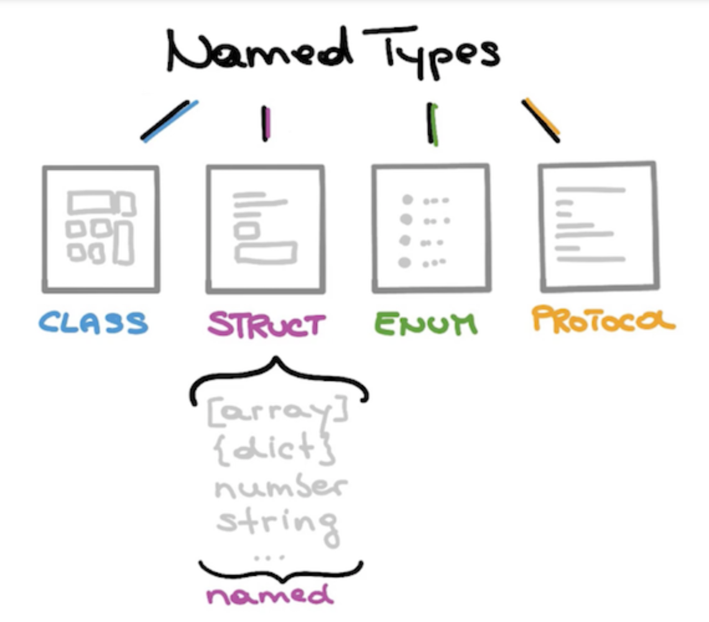

# 컬렉션 자료형

Array, Dictionary, Set이 존재합니다. 하나의 값이 아닌 여러 값을 가질 수 있으므로 컬렉션 자료형이라고 칭합니다. **컬렉션 타입은 별도의 자료형 이름이 아닌 개념적인 자료 구조의 명칭입니다.** 기본자료형과 마찬가지로 named types로부터 만들어져 Swift Standard Library로 전달됩니다. 



## Array

단순히 순서번호 (index)에 따라 값이 저장되어 있는 구조입니다.

```swift
let myArray: [String] = ["a", "b", "c"]
```

## Dictionary

사전처럼 "Key: Value"의 구조로 이루어져 값이 저장되는 구조입니다.
```swift
let myDict: [String: Int] = ["a": 1, "b": 2, "c": 3]
```

## Set

집합입니다. 여러 값들의 묶음을 말하며 순서가 존재하지 않고 동일한 값은 하나의 값으로 합쳐집니다. Set에 들어갈 수 있는 값들은 중복값이 오지 못하게 막을 수 있어야 하기 때문에 자체적으로 Hash 값을 생성할 수 있는 Hashable 자료형 (String, Int, Bool 등)들 입니다.

```swift
let mySet: Set = ["a", "b", "c"]
```
