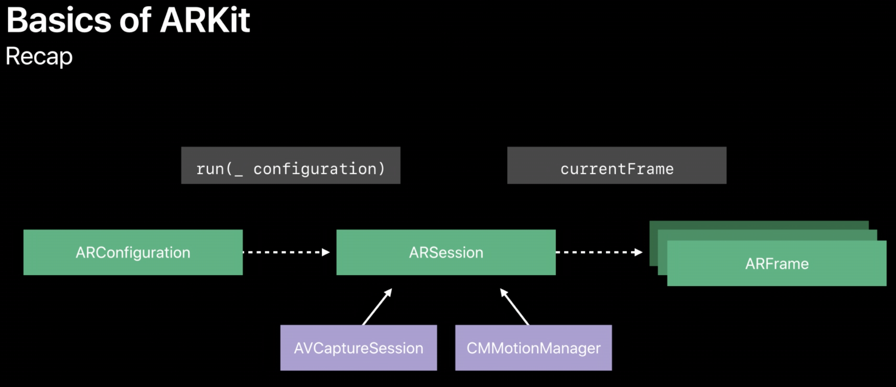
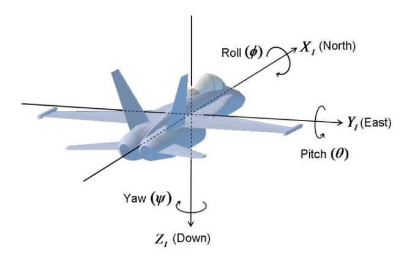
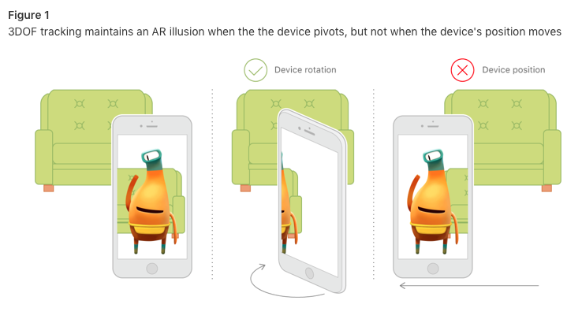
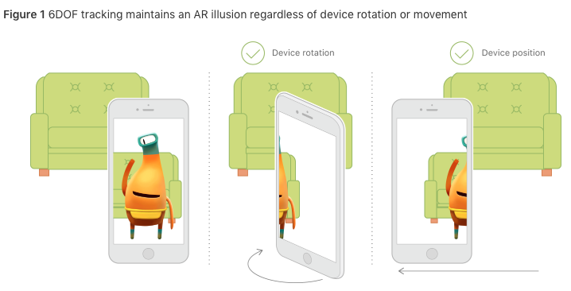

# ARKit 이해 #

## 기본 동작 로직 ##

#### Ref : [WWDC 2018 Understanding ARKit Tracking and Detection](https://developer.apple.com/videos/play/wwdc2018/610/) ####

첫번째로 **ARSession**은 구성에서부터 AR Technology 실행까지 모든 것을 다루는 객체입니다.

ARSession을 구성하였다면, 이제 다음에 실제로 어떤 분류의 기술들을 실행하고 싶은지 설명해주어야합니다.

여기서 어떤 분류라 함은, 어떠한 Tracking 기술을 사용할지, 혹은 어떠한 feature들이 가능해야하는지 등을 예로 수 있습니다. 즉 **ARConfiguration**를 설정 한 후, ARSession의 **run(_ configuration)** 메소드를 통해, 구성한 ARConfiguration를 호출하여, 세션을 돌립니다.

이후 ARSession의 내부적으로, 이미지들을 받기 위해, **AVCaptureSEssoin**을 구성하려고 할 것입니다. 게다가 motion sensor 데이터를 받아오는 것을 시작하기 위해, **CMMotionManager**를 호출할 것입니다.

즉, 기본적으로 ARKit용 기기의 built-in Input 시스템입니다.

processing 후 결과는 초당 60 프레임의 **ARFrame**으로 반환됩니다.

ARFrame은 AR Scene을 렌더링하는 데 필요한 모든 것을 제공하는 스냅 샷입니다.

여기까지가 위의 그림의 내용입니다.

## 기존에 존재했던 AR Technology ##

### Orientation Tracking ###

**Orientation(방향)에 대해서만** Tracking을 하는 기술입니다. 기존의 ARKit에 보면 **AROrientationTrackingConfiguration**이 존재합니다.

#### AROrientationTrackingConfiguration ####

기기의 orientation만 tracking하는 configuration.

정확히는 3DOF(three degrees of freedom), 즉, 세 개의 회전 축(roll, pitch, yaw)에 대해서 tracking을 한다고 볼 수 있습니다.

#### roll, pitch, yaw란? ####

어떠한 object가 가지는 좌표계에서 한 좌표축(X, Y, Z)에 대한 회전을 가리키는 용어ㅇ입니다.

**roll**  : **X축**(object의 전,후 방향)을 기준으로 회전 하는 것입니다.

**pitch** : **Y축**(object의 좌,우 방향)을 기준으로 회전 하는 것입니다.

**yaw**   : **Z축**(object의 수직 방향)을 기준으로 회전 하는 것입니다.

자세한 내용은 아래의 그림을 참고하시면 좋을 것 같습니다.

Ref: [Roll? Pitch? Yaw?](https://m.post.naver.com/viewer/postView.nhn?volumeNo=4249905&memberNo=2493468&vType=VERTICAL)

이러한 3DOF만을 가지고 하는 motion tracking의 기본적 단계에서는 제한된 AR 경험을 할 수 밖에 없습니다. 이 configuration을 통해 가상의 object는 현실 세계에 표현이 될 수 있고, 기기를 회전 시켜봤을 때에도 tracking을 합니다. 하지만, 이 configuration은 기기의 이동에 대하여 tracking을 할 수 없습니다. 추가적으로, 3DOF Tracking은 plane(평면) detection, hit testing을 지원하지 않습니다.

아래의 그림은 **AROrientationTrackingConfiguration**에 대하여 잘 표현하고 있습니다.

rotation에 대해서는 가능하나, 기기를 이동시켰을 경우에는 더 이상 tracking을 하지 못합니다.

Ref: [AROrientationTrackingConfiguration](https://developer.apple.com/documentation/arkit/arorientationtrackingconfiguration)

### World Tracking ###

현실과 가상공간 간의 일치를 만들기 위해, ARKit은 **VIO(Visual-Inertial Odometry)**라는 기술을 사용합니다. World Tracking은 또한 scene의 내용들을 이해하고, 분석합니다. **hit-testing 기능(ARHitTestResult)**를 이용하여, 카메라의 이미지 안에 있는 특정 포인트들과 대응하는 실제 세계의 부분을 찾습니다. 또한 만약 현재 ARsession Configuration에서 **planeDetection**을 세팅한다면, ARKit은 카메라에 나오는 이미지에 대하여 평평한 면을 찾고, 그들의 위치와 크기를 보고합니다. 이러한 hit-test 결과 혹은 발견된 평면들을 사용하여, scene에 가상의 컨텐츠를 배치하거나, 상호작용을 할 수 있습니다.

#### ARWorldTrackingConfiguration ####

 이 Configuration은 앞서 설명한 OrientationConfiguration과는 다르게, **six degrees of freedom(6DOF)**를 사용합니다. 3DOF의 roll, pitch, yaw와 함께 세개의 translation 축들(x, y, z에 대한 움직임)입니다.

아래의 이미지에서도 볼 수 있듯이, AROrientationTracking과는 다르게 기기를 이동시킬 때에도 Tracking이 가능합니다.

##### 3가지 제공하는 기능 #####

- planeDetection : 평면 탐지. 이것을 ARSession에 ARPlaneAnchor 객체들로 넣어 사용합니다.
- detectionImages : 이미 알고 있는 2D 이미지들의 움직임을 인지, 추적. 이것을 scene에 ARImageAnchor 객체들로 넣어 사용.
- detectionObjects(**ARKit2**) : 알고 있는 3D 객체들을 인지, scene에 ARObjectAnchor 객체들로 넣어 사용.
- hit-testing Methods : ARFrame, ARSCNView, ARSKView 등에 hit test를 사용하여, 카메라 화면의 2D 포인트에 대응하는 실제 세계의 3D 포인트를 찾음.

#### VIO(visual-inertial odometry, 시각적 관성 거리계) ####

이 프로세스는 iOS 기기의 모션 감지 하드웨어의 정보와 기기의 카메라에서 볼 수있는 scene의 컴퓨터 비전 분석을 결합합니다. ARKit은 scene 이미지의 주목할 만한 특징들을 인식하고, 비디오 프레임에서 이러한 특징들의 위치 차이를 추적, 해당 정보를 동작 감지 데이터와 비교합니다. 그 결과, 기기의 위치와 동작을 고정밀도로 모델링합니다.

#### ARHitTestResult [Class] ####

ARSession의 기기 카메라 뷰에서의 한 지점을 검사하여, 실제 세계의 표면에 대한 정보를 찾을 수 있습니다. 자세한 사항은 추후 더 작성 혹은 [애플 문서](https://developer.apple.com/documentation/arkit/arhittestresult)를 참고하면 좋을 것 같습니다.

#### World Tracking에 대한 분석(Best Practices and Limitations) ####

 World Tracking은 정확하지 않습니다. 이 과정은 실제적인 AR을 놀라운 정확도로 보여줄 수 있지만, 어찌돼었든, 항상 일관적이지 않거나, 실시간으로 측정하기 어려울 때도 존재한다는 기기의 물리적환경의 디테일들에 의존합니다. 높은 퀄리티의 AR을 만들고 싶다면, 아래의 3가지 팁들을 인지하고 있어야합니다.

 1. 예측 가능한 빛? 광도? 조건 하에 AR을 디자인해야합니다.

    World Tracking은 이미지 분석을 통해서 하기 때문에 깨끗한 이밎가 필요합니다. Tracking 퀄리티는 카메라가 디테일한 요소들을 볼수 없을 경우에 낮아집니다.(ex 빈 벽이나 어두운 scene에 대해서는 Tracking하기 어렵습니다.)

 2. 유저 피드백을 제공하기 위해 tracking 퀄리티 정보를 사용합니다.

    World tracking은 이미지 분석과 기기의 동작을 서로 연관 시킵니다.

 3. 명확한 결과를 만들기 위해 평면 탐지에 시간을 충분히 주고, 만약 필요한 결과를 얻었다면, 평면 탐지를 종료합니다.
  평면 탐지 결과들은 시간에 따라 다양하기 때문입니다.

### Plane Detection ###

 세션이 카메라에서 캡쳐된 이미지 내에서 자동적으로 평평한 표면을 찾으려 하는지 여부 및 방법입니다. 단순히 말하자면 수직, 수평에 대한 평면을 찾는 방법입니다.

이 기술은 **ARWorldTrackingConfiguration**에서의 insatcne Property로 존재합니다.

기본 값으로는, 평면 탐지가 꺼져있으며, 만약 수평 혹은 수직에 대하여 평면 탐지를 세팅한다면, 세션은 **ARPlaneAnchor** object들을 추가하고, 각각에 쓰여진 뷰에 따라 **ARSessionDelegate, ARSCNViewDelegate, or ARSKViewDelegate** 에서 캡쳐된 비디오 이미지들의 공간이 평면인 표면으로 나타나는지 탐지하여, 알려줍니다.
