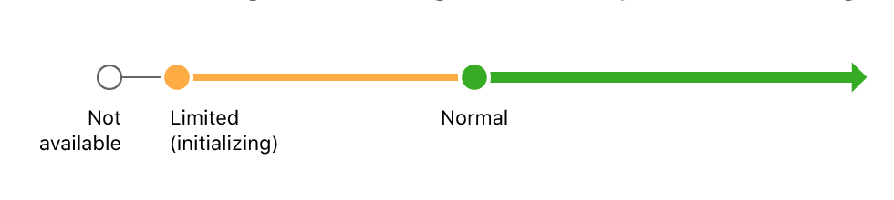
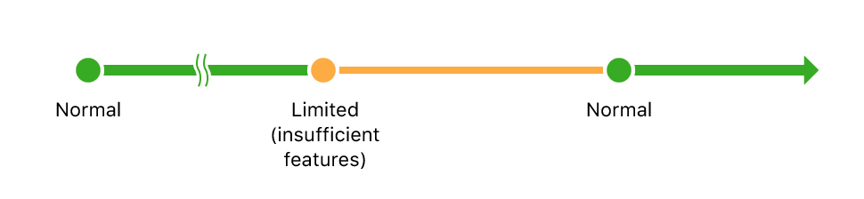
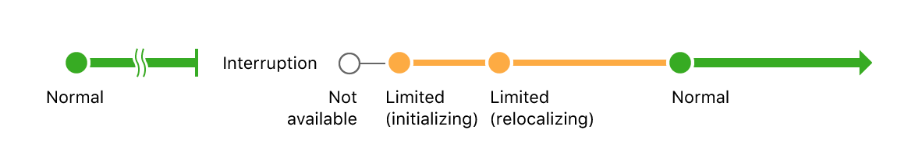
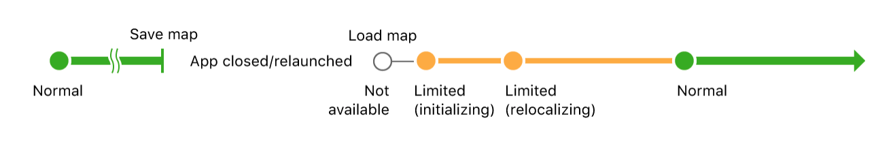

# ARSession & ARConfiguration #

## ARSession이란 ##

AR을 만드는데에 있어서 필요한 기기 카메라 및 모션 처리를 관리하는 공유 객체.


ARSession 객체는 AR을 만들기 위해 ARKit이 수행하는 주요 프로세스를 조정합니다.

이러한 프로세스들에는 기기의 모션 감지 하드웨어로부터 데이터 읽기, 기기의 내장 카메라 조정, 캡쳐된 카메라 이미지들을 이미지 분석 작업 수행이 포함되어 있습니다.


세션은 이 모든 결과들을 통합하여, 사람이 AR Content를 모델링한 가상 공간과 기기가 존재하는 실세계의 공간 간의 일치성을 설정합니다.

ARKit으로 만들어진 모든 AR 앱들은 하나의 ARSession 객체를 필요로 합니다. 만약 AR 앱의 시각적 부분을 쉽게 빌드하기 위해, ARSKView 혹은 ARSCNView를 사용한다면, View 객체에는 ARSession 인스턴스가 포함됩니다.

만약 자체적으로 렌더러를 만들어 빌드하는 경우에는, ARSession을 직접 인스턴스화 하고, 유지관리를 해주어야합니다.

 세션을 실행시키기 위해서는 **Configuration**이 필요합니다. ARConfiguration 클래스의 서브클래스들은 ARKit이 어떻게 실 세계와 관련하여 기기의 위치와 모션 등을 추적할지을 정해주므로, 사용자가 만들 수 있는 AR 체험들의 종류에 영향을 주게 됩니다.


## ARConfiguration ##

AR Session을 실행하기 위해서는, 앱 혹은 개입에서 사용하고자 하는 AR experience의 종류를 제공하는 구체적인 **ARConfiguration** subclass 인스턴스를 생성해야합니다. 이후 session의 run 메소드에 configuration을 추가하여 설정해줍니다.

ARKit은 몇 개의 구체적인 configuration을 가지고 있는데, 아래에 구분을 하였습니다.

| Configuration | Description |
|:--------|:--------|
|**ARWorldTrackingConfiguration** | 후면 카메라를 이용하여, 정확히 기기의 위치, orientation, 평면 탐지, hit testing, 환경 기반 빛 처리, 이미지, 객체 탐지를 tracking하는 데에 사용하는 높은 퀄리티의 AR을 제공합니다. |
|**AROrientationTrackingConfiguration** | 후면 카메라를 사용, 오직 기기의 orientation만 tracking하는 기본적인 AR을 제공합니다.|
|**ARImageTrackingConfiguration(*iOS 12 beta*)** | 후면 카메라를 사용, 사용자의 환경과 관계 없이 보이는 이미지들을 tracking하는 기본적인 AR을 제공합니다.|
|**ARFaceTrackingConfiguration** | 전면 카메라를 사용, 사용자의 얼굴의 표죵, 움직임 등을 tracking 하는 AR을 제공합니다.|
|**ARObjectScanningConfiguration(*iOS 12 beta*)** | 후면 카메라를 사용하여 높은 정확성의 공간 데이터를 수집하고, 다른 AR experience들에서 탐지할 reference object들을 만듭니다.|


## Session의 생명주기와 Tracking 퀄리티 관리 ##

**피드백을 제공**, **인터럽트들로부터 복구**, **이전 세션들을 다시 실행**함으로써, AR 앱을 더 견고하고 좋게 만들 수 있습니다.


앞서 **ARKit 이해** 위키에 작성하였듯이, World-tracking AR 세션들은 ***visual-inertial odometry*** 라는 기술을 사용합니다. 이 측정법이 최상의 결과를 얻기 위해서는, world tracking은 일관된 센서 데이터와 시각적으로 복잡하거나, 인식 가능한 특징들을 가진 카메라 이미지가 필요합니다.

 세션을 시작하면, ARKit이 기기의 위치를 정확하게 모델링하기에 충분한 데이터를 수집하는데에 시간이 걸립니다. 세션이 진행되는 동안에 world-tracking 퀄리티에 영향을 주는 조건들이 변할 수 있습니다. 따라서 이러한 변화들을 따르려면, **ARSessionObserver delegate** 메소드와, **ARCamera** 속성들을 이용해야합니다.


### AR Session의 기본 생명 주기 ###





위의 그림은 AR session이 돌기 시작하였을 때에 tracking 상태 변화를 보여주는 그림입니다.

새로운 세션을 시작한 바로 직후에, 바로 나오는 프레임들에 대한 tracking 상태는 **ARCamera.TrackingState.notAvailable** 입니다.

소량의(?) 프레임이 지난 후에, tracking상태는 **ARCamera.TrackingState.limited**로 변경이 됩니다. 이 때의 이유는 **ARCamera.TrackingState.Reason.initializing** 즉 아직 tracking 정보를 제공하기에 충분하지 않기 때문입니다.

어느정도의 짧은 시간이 지난 후에는 **ARCamera.TrackingState.normal** 상태로 변경이 됩니다. 여기서 부터는 충분한 결과물들이 제공됩니다.


### Tracking 퀄리티 변화에 대한 피드백 제공 ###



위의 그림은 tracking 상태가 유저의 상호작용 혹은 환경이 변화하여 발생할 수 있는 경우입니다.


Tracking 퀄리티가 **ARCamera.TrackingState.limited** 일 때에, 사용자의 로컬 환경에 매핑된 ARKit에 의존하는 특징들은 더 이상 이용가능하지 않습니다.

- 평면 탐지가 평면 앵커를 추가하거나 업데이트를 하지 않습니다.
- Hit-test 방법은 결과를 제공하지 않습니다.


AR 세션은 유저가 기기를 움직이거나, 사용자의 로컬 환경의 변화에 따라,  **ARCamera.TrackingState.limited** tracking 상태에 언제든지 들어갈 수 있습니다.

예를 들어 사용자가 기기를 빈 벽을 비추도록 하거나, 방의 불을 끄거나 한다면, tracking 퀄리티는 **ARCamera.TrackingState.Reason.insufficientFeatures.** 상태이기 때문에 감소될지도 모릅니다.

연관된 **ARCamera.TrackingState.Reason**값들을 이용하여, 사용자가 그러한 상황을 잘 해결하여 결국 **ARCamera.TrackingState.normal** 상태에 도달하도록 할 수 있습니다.


### AR세션 인터럽트로부터의 복구 ###

ARKit는 ARSession이 동작하지 않으면, 기기의 위치를 tracking 할 수 없습니다. 기본적으로, 만약 제 세션이 인터럽트를 당하였다면,(ex. 다른 앱으로의 변경), 해당 세션의 어떠한 가상 컨텐츠들도 실제 환경과 비교했을 때에 위치가 맞지 않는 부적절한 상황이 올 것입니다.

여기에서 **relocalization**을 사용하여, 인터럽트로부터의 복구를 시도 할 수 있습니다. 만약 **sessionShouldAttemptRelocalization(_:)**로 부터 true 값을 리턴 받는다면, ARKit은 인터럽트 이전의 유저의 환경의 정보,상태와 현재 카메라와 센서 데이터를 중재(reconcile)하도록 시도할 것입니다. 이 과정 동안에, tracing state는 **limited**(이유는 **relocalizing**)이 되며, 만약 이 작업에 성공한다면, 얼마 지나지않아, tracking 상태는 **normal**을 반환합니다.

아래는 인터럽트 과정에 대한 상태 변화를 그림으로 나타낸 것입니다.



relocalization이 성공하려면, 기기는 세션이 인터럽트 되었을 때 어디 근처에 있었는지 position과, orientation 값을 반환해야합니다. 만약 이러한 조건들이 절대 발생하지 않는다면(예를 들어, 기기가 완전이 다른 환경으로 이동시), 그 세션은 **relocalizing** 상태에 무기한적으로 남습니다.

**중요**

```
 앱이 relocalizing 상태에 있다면, 위와 같이 무기한적으로 relocalizing이 안될 가능성이 있는 경우를 대비하여,
 세션을 리셋하는 방법(resetTracking 혹은 run)을 제공해주어야 한다.
```


### 지속되는 AR Experience 만들기 ###

iOS 12.0부터 ARWorldMap 클래스는 ARKit이 세션을 다시 실행하기 위해 사용하는 정보들을 저장합니다. world map을 파일로 저장함으로써, 동일한 relocalization 과정을 앱이 다시 시작하더라도, 잠시의 인터럽션으로부터의 복구 혹은 앞선 세션으로부터 resume하는 것에 사용 할 수 있습니다.

또한 WorldMap들은 anchor들에 대한 정보도 포함하고 있으므로, 가상 컨텐츠를 이전의 세션에 매치되도록, 가상 컨텐츠를 대체할 수도 있습니다.

**중요**

```
ARWorldMap을 이용하여 세션을 다시 시작하는 것의 신뢰성은 실제 환경에 크게 의존됩니다.
예를 들어, 일관된 인공 조명 아래 실내에서 기록한 map 또는 사전에 순간 캡처한 map은 성공적으로 relocalize를 하기 쉽습니다.
하지만, 시간이 지남에 따라 조명 환경이나 특성들이 바뀌면 성공 가능성이 낮아집니다.
```




위의 그림은 앱을 끄거나 닫을 경우 등에 대하여 map을 저장, 다시 불러와 지속성을 유지시켜주는 것을 그림으로 나타낸 것입니다.


### ARCamera Tracking State ###

#### ARCamera ####

AR session에서 캡쳐된 비디오 프레임의 이미지 특징들과 카메라 위치에 대한 정보.

#### Tracking State ####


| Tracking State | Description |
|:--------|:--------|
|**notAvailable** | 카메라 위치 tracking이 가능하지 않습니다. |
|**limited(TrackingState.Reason)** | tracking은 가능하지만, tracking한 결과물의 퀄리티가 모호한 상태입니다.|
|**normal** | 카메라 위치 tracking이 바람직한 결과물들을 제공합니다.|


#### TrackingState.Reason ####

Tracking 상태가 limited인 경우의 이유에 대한 정리.

| Reason | Description |
|:--------|:--------|
|**initializing** | ARSession이 아직 tracking 정보를 제공하기에 충분한 카메라 혹은 모션 데이터를 얻지 못할 경우입니다. |
|**relocalizing** | ARSession이 인터럽트 이후에 다시 시작하기 위해 시도할 경우입니다.|
|**excessiveMotion** | 기기를 너무 빨리 움직여서, 정확한 이미지에 기반한 위치 tracking이 힘든 경우입니다.|
|**insufficientFeatures** | 카메라에 보이는 scene이 이미지 기반 위치 tracking을 위한 충분한 구별 가능한 특성들을 갖고 있지 않은 경우입니다. |
