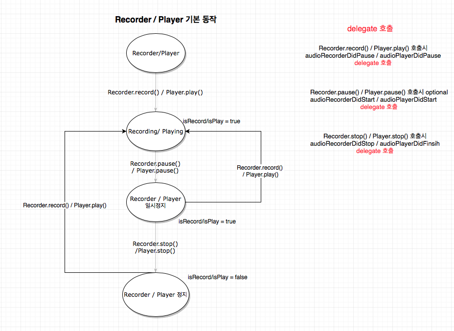
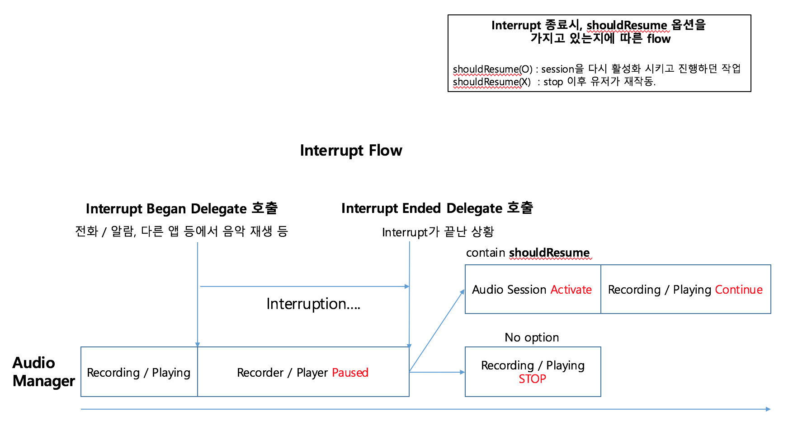

# Audio #

## Fundamental Flow ##




## Route Change Flow ##


## Intuerruption Flow ##



## Usage ##

create AudioManger Instance.

```swift
// create instance with record file name
// create instance called setupSession, createRecorder(fileName: fileName), setupNotification()
audioManager = AudioManager(fileName: "sample")

// set delegate
audioManager.delegate = self

// request microphone permission
audioManager.requestMicrophonePermission { (allow) in
}
// record start
audioManager.record()
// record pause
audioManager.recordPause()
// record stop
audioManager.recordStop()
// player play
audioManager.play()
// player pause
audioManager.audioPlayerPause()

```

### Documentation ###


#### Method ####

- **init**(fileName: String, category: String = AVAudioSessionCategoryPlayAndRecord, categoryOptions: AVAudioSessionCategoryOptions = [.allowBluetooth, .allowBluetoothA2DP])

AudioManager를 생성하는 코드입니다.

Parameter로는, fileName, category, categoryOption들이 있으며,

fileName은 처음에 녹음할 파일의 이름, category는 AVAudioSessionCategory들 중 하나를 선택해야하며, 만약 그 중에서 선택하지 않을 경우, AVAudioSessionCategory의 default값인 'AVAudioSessionCategorySoloAmbient'이 선택이 됩니다.

- **createRecorder**(fileName: String, recordSettings: [String: Any]) -> String?

녹음할 파일의 이름을 설정하고, 자신이 custom할 녹음세팅이 있다면, 세팅을 해줍니다. 기본적인 녹음세팅이 들어가 있으며, Recorder를 생성하였다면, 파일의 경로를 반환, 생성하지 못하였다면, nil값을 반환해줍니다.

- **activeSession**(completionHandler: CompletionHandler?)

AudioManager를 사용하고 있는 앱의 세션을 활성화시켜주는 코드입니다. completionHandler를 통해 세션이 활성화가 되었다면 true, 실패하였다면 false를 반환합니다.

- **deactivateSession**(notifyOthersOnDeactivation: Bool = false, completionHandler: CompletionHandler?)

AudioManager를 사용하고 있는 앱의 세션을 비활성화시켜주는 코드입니다.
파라미터로 있는 notifyOthersOnDeactivation가 true라면, 앱의 세션이 비활성화 되었다는 것을 다른 앱들에게도 알려주어, 다른 앱이 세션을 점유할 수 있게 해줍니다. false라면, 다른 앱들에게 알려주지 않아, 다른 앱이 세션을 활성화 시켜야 사용할 수 있게 됩니다. completionHandler를 통해 세션이 비활성화 되었다면 ture, 실패하였다면 false를 반환합니다.

- **useLoudSpeaker**(completionHandler: CompletionHandler?)

기본 폰의 작은 소리가 아닌, 스피커 모드로 변환을 해주는 코드입니다.
CompletionHandler를 통해, 스피커로 전환 된다면 true, 실패시 false를 반환합니다.

- **useDefaultOutput**(completionHandler: CompletionHandler?)

오디오를 현재 카테고리와 모드에 맞는 시스템의 default 출력포트로 변경해주는 코드입니다.
CompletionHandler를 통해, default로 변경이 된다면, true, 실패시 false를 반환합니다.


#### Property ####

 - **retryCount**: when interrupt end, then this app's session can activate. but sometimes get audiosession fail. so retry to get audio session for this app by looping retryCount(default value = 10).
 - **isPlay**: get-only property.
    - true : audioPlayer playing or pause.
    - false : audioPlayer finish.
 - **isRecord**: get-only property.
    - true : audioRecorder recording or pause.
    - false : audioRecorder finish.
 - **recordEndTime**: get-only property, when user stop record, then recordEndTime update by current record.stop()
 - **recordedFileUrl**: get-only property, when user want to know recordedfile's url.
 - **AudioManagerDelegate**: AudioManagerDelegate.

#### Delegate(some may optional) ####

 - **audioRecorderDidStart**(_ recorder: AVAudioRecorder)
   - audioRecorder started.

 - (*optional*)**audioRecorderDidPause**(_ recorder: AVAudioRecorder)
   - audioRecorder paused.
 - **audioRecorderDidStop**(_ recorder: AVAudioRecorder)
   - audioRecorder stoped.
 - **audioPlayerDidStart**(_ player: AVAudioPlayer, error: Error?)
   - audioPlayer started.
 - (*optional*)**audioPlayerDidPause**(_ player: AVAudioPlayer)
   - audioPlayer paused.
 - **audioPlayerDidFinsih**(_ player: AVAudioPlayer, successfully flag: Bool)
   - audioPlayer finished.
 - **audioPlayerDecodeErrorDidOccur**(_ player: AVAudioPlayer, error: Error?)
   - audioPlayer Decode Error occured.
 - (*optional*)**routeDidChanged**(reason: AVAudioSessionRouteChangeReason)
   - route is changed.
 - **routeDetectNewDevice**(_ newInputPortName: String, newOutputPortName: String)
   - plugged in new device's inputPort, outputPort.
 - **routeRemoveOldDevice**(_ oldInputPortName: String, oldOutputPortName: String)
   - plugged out old device's inputPort, outputPort.
 - (*optional*)**didInterruptBegin**()
   - other app get audio session so this app's audio session interrupted.
 - **didInterruptEnd**(shouldResume: Bool)
   - other app release that app's audio session so this notice for this app's session, record, play can activate.


### Audio Interruption Observe ###

this app used **AVAudioSessionInterruptionNotification** for observing Interruption begin and end.

Especially, when Interruption end, Notification's userinfo may have **AVAudioSessionInterruptionOptionKey** 's **shouldResume** for check this app can re-activate app's session so that recording can be maintainted.

### Route Change Observe ###

this app used **AVAudioSessionRouteChangeNotification** for observing route change.

### Reference:
https://oss.navercorp.com/JTF-P9/mskimProject/tree/master/AVAudio
