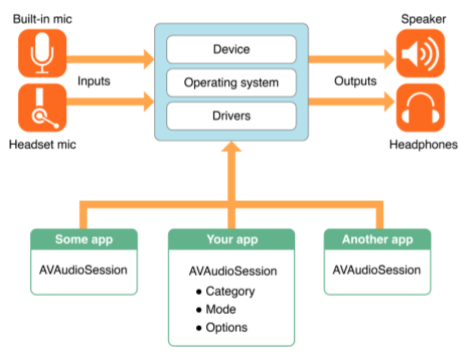
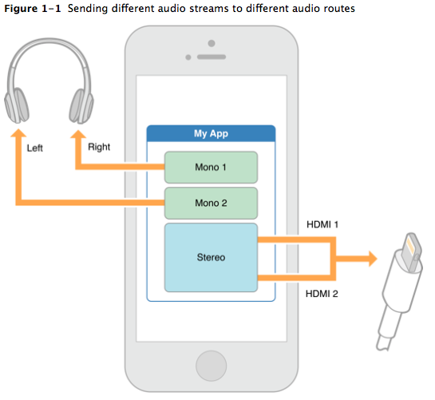
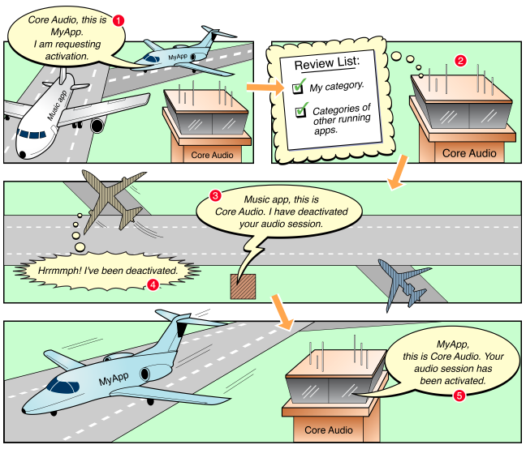
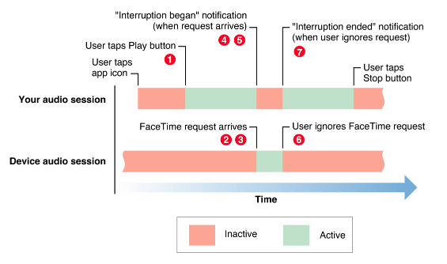
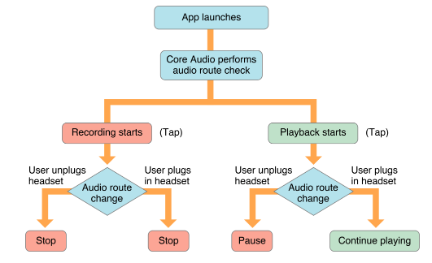

# AVAudio Session Programming #



AVAudioSession은 앱 내에서 어떻게 오디오를 사용할 건지 시스템과 통신하는 중간 역할을 하는 객체입니다.

즉, 내 앱과 운영체제(기본적인 오디오 하드웨어) 사이의 중개자로서 역할을 하는 것입니다.

**오디오 세션 프로그래밍**은, 크게 다음과 같이 나눌 수 있습니다.

- Configuring an Audio Session(오디오 세션 설정)
- Activating an Audio Session(오디오 세션 활성화)
- Responding to Interruptions(인터럽트에 대한 대응)
- Responding to Route Changes(라우트 변경시에 대한 대응)
- Configuring Device Hardware(디바이스 하드웨어 설정)

## Configuring an Audio Session(오디오 세션 설정) ##

오디오를 어떻게 사용할 것인지 정하는 데에는, **category**와 **mode**를 사용 목적에 맞게 설정하여, 기본 오디오 시스템에 전달이 되어야합니다.

**category**를 설정하는 것은 앱 내의 오디오 사용에 대한 주요 요소입니다. category를 세팅함으로서, 시스템에 앱의 오디오를 사용하는 의도를 나타냅니다.

기본 오디오 세션의 카테고리가 있는데, 그것들은 다음의 4가지 요소에 따라 분류를 합니다.

- **Interrupts nonmixable apps audio**(같이 재생되지 않는 앱의 오디오를 인터럽트 하는가): 만약 참이라면, 나의 앱의 오디오 세션을 활성화 하였을 때, 동시 재생되지 않는 앱은, 인터럽트를 받습니다.

- **Silenced by the Silent switch**(무음으로 변경시에 음소거가 되는가): 만약 참이라면, 유저가 무음모드로 변경하였을 때, 앱의 오디오는 음소거가 됩니다.

- **Supports audio Input**(녹음 input을 제공하는가): 만약 참이라면, 앱의 오디오 인풋(녹음)이 가능하다.

- **Supports audio Output**(재생 output을 제공하는가): 만약 참이라면, 앱의 오디오 아웃풋(재생)이 가능하다.


다음은 기본 카테고리에 대하여, 위의 요소들로 분류를 해놓은 표입니다.

| 카테고리 | 무음모드로 변경, 화면 잠금으로 인한 음소거 |  동시 재생이 되지않는 앱의 오디오 인터럽트 |  녹음(Input), 재생(Output) 가능 여부 |
|:--------|:--------|:--------|:--------|
|**AVAudioSessionCategoryAmbient** | Yes |No | 재생만 가능 |
|**AVAudioSessionCategorySoloAmbient (Default)** | Yes |Yes | 재생만 가능  |
|**AVAudioSessionCategoryPlayback** | No |Yes(default); no by using override switch | 재생만 가능  |
|**AVAudioSessionCategoryRecord** | No (화면 잠금 시에도 녹음 계속됨) |Yes | 녹음만 가능  |
|**AVAudioSessionCategoryPlayAndRecord** | No |Yes(default); no by using override switch  | 녹음 재생 둘 다 가능  |
|**AVAudioSessionCategoryMultiRoute** | No |Yes | 녹음 재생 둘 다 가능  |

- AVAudioSessionCategoryAmbient : 앱이 실행되면, 기존 오디오 세션이 계속 실행되면서 앱의 오디오 세션도 같이 동작.
- AVAudioSessionCategorySoloAmbient: 디폴트. 앱 실행시, 다른 오디오 세션은 꺼지고 앱의 오디오 세션만 동작.
- AVAudioSessionCategoryPlayAndRecord : SoloAmbient와 동작은 동일하지만, 녹음도 가능함.
- AVAudioSessionCategoryPlayback : 무음모드 변겅, 화면 잠금 등의 동작을 하여도 앱의 오디오 세션은 지속적으로 동작을 합니다. 다른 오디오 세션과는 같이 동작을 못합니다.
- AVAudioSessionCategoryRecord : 다른 오디오 세션과 같이 동작을 못하지만, 무음모드, 화면 잠금시에도 녹음이 가능함.
- AVAudioSessionCategoryMultiRoute : 다른 오디오 세션과 같이 동작을 못하지만, 무음모드, 화면 잠금시에도 녹음이 가능하며, 기존의 '마지막에 들어온 route로 인식' 이라는 것이 아닌, 연결된 여러 개의 route에 대하여 동작 가능함.


관련 - mode와 그에 적합한 category 리스트

|Mode Identifiers |적합한 categories |
|:--------|:--------|
|**AVAudioSessionModeDefault** | All |
|**AVAudioSessionModeMoviePlayback** | AVAudioSessionCategoryPlayback |
|**AVAudioSessionModeVideoRecording** | AVAudioSessionCategoryPlayAndRecord, AVAudioSessionCategoryRecord |
|**AVAudioSessionModeVoiceChat** | AVAudioSessionCategoryPlayAndRecord |
|**AVAudioSessionModeGameChat** | AVAudioSessionCategoryPlayAndRecord |
|**AVAudioSessionModeVideoChat** | AVAudioSessionCategoryPlayAndRecord |
|**AVAudioSessionModeSpokenAudio** | AVAudioSessionCategoryPlayback |
|**AVAudioSessionModeMeasurement** | AVAudioSessionCategoryPlayAndRecord, AVAudioSessionCategoryRecord, AVAudioSessionCategoryPlayback |

### 오디오 세션의 기본 동작 ###

- 오디오 재생 지원, 녹음은 허용되지 않음.
- (iOS)무음 모드로 변경시 오디오를 재생하는 어떠한 앱이든, 음소거
- (iOS)화면 잠금시,앱의 오디오 음소거.
- 오디오 재생시, 백그라운드에서 재생중인 오디오(음악 재생 앱)는 음소거

오디오 세션 설정

오디오 세션 설정하는 주요 방법은 **카테고리**를 세팅해주는 것입니다. 각 카테고리와 관련 정확한 동작들은 앱의 제어하에 있지 않고, 운영 체제에 의해 설정이 됩니다.

카테고리를 설정하는 것이 기본적인 오디오 동작을 정해주지만, 카테고리의 **모드**를 설정해줌으로써, 더 전문적으로 오디오의 동작을 정해줄 수 있습니다.

다음의 코드는 기본적인 오디오 세션 설정하는 코드 예시입니다.

```swift
// Access the shared, singleton audio session instance
let session = AVAudioSession.sharedInstance()
do {
    // Configure the audio session for movie playback
    try session.setCategory(AVAudioSessionCategoryPlayback,
                            mode: AVAudioSessionModeMoviePlayback,
                            options: [])
} catch let error as NSError {
    print("Failed to set the audio session category and mode: \(error.localizedDescription)")
}
```

### Multiroute 카테고리 사용하는 부가적인 옵션 [link](https://developer.apple.com/library/archive/documentation/Audio/Conceptual/AudioSessionProgrammingGuide/AudioSessionBasics/AudioSessionBasics.html#//apple_ref/doc/uid/TP40007875-CH3-SW4) ###

 Multiroute 카테고리는 다른 카테고리들과는 다릅니다. 다른 카테고리들은, 'last in wins' 즉, 기본 스피커로 듣고 있다가, 이어폰을 꼈을 경우에 기본 스피커는 나오지 않고, 이어폰으로만 듣게 끔하는 동작입니다. 하지만 Multiroute는 연결된 모든 포트들을 사용할 수 있게 합니다. 게다가 다른 포트들의 output에 다른 오디오 스트림들을 전달할 수 있습니다. 예를 들어, 이어폰 왼쪽과 오른쪽에 서로 다른 오디오 스트림을 전달하는 것입니다. 이것은 아래의 그림에 잘 나타나져있습니다.

 


### AirPlay를 위한 카테고리와 모드 ###

Cateories

- AVAudioSessionCategorySoloAmbient
- AVAudioSessionCategoryAmbient
- AVAudioSessionCategoryPlayback

Modes

- AVAudioSessionModeDefault
- AVAudioSessionModeVideoChat
- AVAudioSessionModeGameChat

### 백그라운드에서도 오디오 동작하게 하는 방법 ###

오디오를 백그라운드에서 재생하게 하기위해서는, Xcode의 Capability에서 Background Modes의 Audio, AirPlay, and Picture in Picture 모드를 체크해주어야합니다.

## Activating an Audio Session(오디오 세션 활성화) ##
### 오디오를 요구하는 경쟁을 시스템이 해결하는 방법 ###



위의 시나리오에서 보았듯이, 이미 음악 앱에서 오디오를 사용하고 있고, 나의 앱이 오디오 세션을 활성화 시키려고 했다면,

1. Core Audio에 오디오 세션 활성을 요청합니다.
2. Core Audio가 해당 앱의 오디오 세션을 활성시켜도 되는지 확인합니다.
3. Core Audio가 판단했을 시 활성 시켜도 된다면, 기존의 오디오 세션을 점유하고 있던 음악 앱을 비활성화하라고 명령합니다.
4. 음악 앱은 점유하고 있던 오디오 세션을 비활성화 시킵니다.
5. 마지막으로 Core Audio는 앱의 오디오 세션이 활성화되었다고 전달을 해줍니다.

### 오디오 세션 활성화 / 비활성화 ###
AVFoundation의 playback과 recording 클래스가 자동적으로 오디오 세션을 활성화 시켜 주긴하지만, 수동적으로 활성화 시키는 것은 활성이 진행 되는 과정을 디버깅, 테스트하기에 용이합니다.

다음은 오디오 세션을 활성화 시키는 예제 코드입니다.

```swift
let session = AVAudioSession.sharedInstance()
do {
    // 1) Configure your audio session category, options, and mode
    // 2) Activate your audio session to enable your custom configuration
    try session.setActive(true)
} catch let error as NSError {
    print("Unable to activate audio session:  \(error.localizedDescription)")
}
```

반대로 deactivate는 session.setAcvite(false)로 해주면 됩니다. deactivate관련하여서 백그라운드에서 동작시, 시스템이 비활성화 시킬 때 등에 대한 내용이 있습니다.

### 다른 오디오가 재생중인지 검사 ###
예를 들어, 음악 앱으로 노래를 들으면서 게임 앱으로 게임을 하고 싶어한다고 가정합니다. 일반적으로 게임 앱의 경우에는, 배경음악이 존재하는 경우가 많은데, 이럴 경우에 배경음악을 음소거하고, 음악 앱에서 노래를 들고 싶을 때가 있습니다. 이렬 경우에 미리 음악 앱에서 노래가 나오는 지, 즉 다른 앱에서 오디오를 사용하는지를 체크하여야 하는 과정이 필요합니다. 해당 과정은 두 가지로 확인 할 수 있습니다.

- 앱을 켰을 초기에 확인을 하고 싶다면, applicationDidBecomActive에서 AVAudioSession.sharedInstance().secondaryAudioShouldBeSilencedHint를 통하여 체크를 해줍니다.
- 지속적으로 확인하고 싶다면, AVAudioSessionSilenceSecondaryAudioHintNotification를 이용하여 notification을 등록해주면 됩니다.

아래는 Notification을 등록하는 예시입니다.

```swift
func setupNotifications() {
    NotificationCenter.default.addObserver(self,
                                           selector: #selector(handleSecondaryAudio),
                                           name: .AVAudioSessionSilenceSecondaryAudioHint,
                                           object: AVAudioSession.sharedInstance())
}

func handleSecondaryAudio(notification: Notification) {
    // Determine hint type
    guard let userInfo = notification.userInfo,
        let typeValue = userInfo[AVAudioSessionSilenceSecondaryAudioHintTypeKey] as? UInt,
        let type = AVAudioSessionSilenceSecondaryAudioHintType(rawValue: typeValue) else {
            return
    }

    if type == .begin {
        // Other app audio started playing - mute secondary audio
    } else {
        // Other app audio stopped playing - restart secondary audio
    }
}
```

## Responding to Interruptions(인터럽트에 대한 대응) ##
인터럽트를 다루는 코드를 넣는다면, 내 앱의 오디오 세션이 알람, 전화, 다른 앱 등의 오디오 세션이 활성화가 되어도, 잘 동작하게 됩니다.

### Interruption 라이프 사이클 ###
아래의 시나리오는, 앱으로 오디오를 재생하는 도중 FaceTime이라는 인터럽트가 온 경우에 대한 시나리오입니다.



1. 앱이 활성 상태이고, 오디오 재생을 누릅니다.
2. 오디오가 재생되는 도중, FaceTime 요청이 오고, 시스템은 FaceTime 앱의 오디오 세션을 활성화 시킵니다.
3. 시스템은 내 앱의 오디오 세션을 비활성화 시키고, 앱의 오디오는 멈춤 상태가 됩니다.
4. 시스템은 나의 앱에 앱 내의 오디오 세션이 비활성화 되었다고 알림을 보내줍니다.
5. 만약 인터럽트 처리 관련 코드가 있다면, 이 Notification을 처리해주는 부문에서, UI를 업데이트 하거나, 멈춘 오디오의 시간을 저장하는 동작 등을 하게 됩니다.
6. 유저가 FaceTime 등의 인터럽트를 무시했을 경우에 시스템은 나의 앱에 인터럽트가 끝냈다고 알림을 보냅니다.
7. 내 앱의 notificaiton 처리 부분에서 인터럽트가 끝난 것에 대한 적절한 처리(UI 업데이트, 오디오 세션 활성화, 오디오 다시 재생 등)을 해줍니다.
8. 그림에는 나타나있지 않지만, 만약 유저가 인터럽트 들어 온 작업(FaceTime 전화를 받는 것 등)을 처리할 경우에, 앱은 정지상태가 됩니다.

### 오디오 Interruption 처리하는 기술 ###

AVAudio에서 보내주는 인터럽트 Notification을 등록하여 인터럽트에 대한 처리를 합니다.

- 인터럽트 발생 시작 이후
	- state와 context를 저장
	- UI 업데이트
- 인터럽트 종료 이후
	- state와 context 복원
	- UI 업데이트
	- 앱 내에서 적절할 경우에 오디오 세션 재활성화.

### 오디오 Interruption 관찰 ###

AVAudioSessionInterruptionNotification이라는 Notification을 등록함으로써, 오디오 Interruption을 처리할 수 있습니다. 아래는 예시 코드입니다.

```swift
func registerForNotifications() {
    NotificationCenter.default.addObserver(self,
                                           selector: #selector(handleInterruption),
                                           name: .AVAudioSessionInterruption,
                                           object: AVAudioSession.sharedInstance())
}

func handleInterruption(_ notification: Notification) {
    guard let info = notification.userInfo,
        let typeValue = info[AVAudioSessionInterruptionTypeKey] as? UInt,
        let type = AVAudioSessionInterruptionType(rawValue: typeValue) else {
            return
    }
    if type == .began {
        // Interruption began, take appropriate actions (save state, update user interface)
    }
    else if type == .ended {
        guard let optionsValue =
            userInfo[AVAudioSessionInterruptionOptionKey] as? UInt else {
                return
        }
        let options = AVAudioSessionInterruptionOptions(rawValue: optionsValue)
        if options.contains(.shouldResume) {
            // Interruption Ended - playback should resume
        }
    }
}
```

아래의 handleInterruption 코드에서, type이 ended의 경우, userInfo 딕셔너리는, InterruptionOptions를 가질 수 있는데, 현재 이 options에는 AVAudioSessionInterruptionOptionShouldResume라는 값이 있습니다. 이 값이 있을 경우에, 앱은 멈춘 오디오를 다시 재생해야합니다. 만약 없을 경우에는, 유저가 시작하기 전까지는 재생을 다시 하지않습니다.

**begin interruption이 온다고 하여, 그에 대응되는 end interruption이 반드시 온다는 보장은 없습니다.**


## Responding to Route Changes(라우트 변경시에 대한 대응) ##

 앱이 동작시, 유저는 헤드셋을 연결하거나, 제거, 혹은 도킹 스테이션을 오디오 연결에 사용할 수도 있습니다. *iOS HUman Interface Guidelines* 는 어떻게 앱이 이러한 상황에 대응해야하는지 설명합니다. 바로 오디오 하드웨어 route의 변경을 처리해주는 코드를 넣어주면 됩니다.

### 오디오 하드웨어 route 변화의 다양성 ###

오디오 하드웨어 route는 직역하면, 오디오 신호를 위한 유선으로 연결된 전자적 연결입니다. 유저의 기기가 헤드셋을 빼거나 낄때에 시스템은 오디오 하드웨어 route를 자동으로 변경해줍니다. 이러한 변화를 사용자는 **AVAudioSessionRouteChangeNotification** 라는 notification을 등록함으로써, 알림을 받을 수 있습니다. 아래의 그림은 녹음, 혹은 재생 중에 route가 변경 된 것을 보여줍니다.




### 오디오 Route 변화 관찰 ###
헤드폰, 블루투스 LE 헤드셋, USB 오디오 인터페이스 등을 연결하거나 해제 하는 과정 등의 변화가 오디오 route 변경이 발생하게 됩니다. 아래는 앞서 말한 **AVAudioSessionRouteChangeNotification** 라는 notification을 등록하는 과정에 대한 예시 코드입니다.

```swift
func setupNotifications() {
    NotificationCenter.default.addObserver(self,
                                           selector: #selector(handleRouteChange),
                                           name: .AVAudioSessionRouteChange,
                                           object: AVAudioSession.sharedInstance())
}

func handleRouteChange(notification: NSNotification) {
    guard let userInfo = notification.userInfo,
        let reasonValue = userInfo[AVAudioSessionRouteChangeReasonKey] as? UInt,
        let reason = AVAudioSessionRouteChangeReason(rawValue:reasonValue) else {
            return
    }
    switch reason {
    case .newDeviceAvailable:
        let session = AVAudioSession.sharedInstance()
        for output in session.currentRoute.outputs where output.portType == AVAudioSessionPortHeadphones {
            headphonesConnected = true
        }
    case .oldDeviceUnavailable:
        if let previousRoute =
            userInfo[AVAudioSessionRouteChangePreviousRouteKey] as? AVAudioSessionRouteDescription {
            for output in previousRoute.outputs where output.portType == AVAudioSessionPortHeadphones {
                headphonesConnected = false
            }
        }
    default: ()
    }
}

```

이 Notification의 userInfo 딕셔너리에는, Route 변화에 대한 상세한 정보가 제공됩니다. 특히나 **AVAudioSessionRouteChangeReason** 이 키 값을 통해, 유저는 새로운 기기가 연결 되는지 등에 대한 정보를 얻게 되고, 새로 디바이스가 연결된 경우에는 오디오 세션의 currentRoute의 output의 portType이 어떠한 타입인지, 체크를 할 수 있습니다. 이전 디바이스의 상태도 Notification의 userInfo에서 **AVAudioSessionRouteChangePreviousRouteKey** 이 키 값을 통하여, 기존의 기기를 알 수 있습니다.

## Configuring Device Hardware(디바이스 하드웨어 설정) [link](https://developer.apple.com/library/archive/documentation/Audio/Conceptual/AudioSessionProgrammingGuide/OptimizingForDeviceHardware/OptimizingForDeviceHardware.html#//apple_ref/doc/uid/TP40007875-CH6-SW1) ##

오디오 세션 속성들을 이용하여 런타임시 기기 하드웨어를 위해 앱의 오디오 동작을 최적화를 할 수 있습니다.
