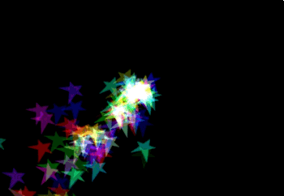

# CALayer

이미지 기반 컨텐츠를 관리하고 해당 컨텐츠에 대해 애니메이션을 수행할 수 있는 개체입니다. 레이어는 뷰에서 눈에 보여지는 부분을 다루는 중요한 기능입니다.

뷰에는 하나의 레이어만 있을 수 있습니다. 대신 레이어는 서브레이어(Sublayers)를 여럿 가질 수 있습니다. 그리고 이름답게 다층(multi layer) 구조로 구성 할 수 있습니다.

뷰를 여러개 쌓아서 만드는 것에 비해, 같은 모양을 레이어를 쌓아서 만드는게 훨신 가볍기 때문에 애니메이션 등에 유리합니다.

간단히 말해서, CALayer는 NSObject에서 상속되며, **렌더링, 애니메이션 등의 보이는 부분에 초점을 맞춥니다.**  layer의 기본 작업은 사용자가 제공하는 시각적 콘텐츠를 관리하는 것이지만 배경색, 테두리 및 그림자 같은 시각적 속성 역시 설정되어 있습니다. 시각적 콘텐츠 관리 외에도, 계층은 해당 콘텐츠를 화면에 표시하는 데 사용되는 콘텐츠의 형태(위치, 크기 및 변환 등)에 대한 정보도 유지합니다.


## CAShapeLayer

CASHapeLayer는 확장 가능한 벡터 경로를 사용하여 이미지를 사용하는 것보다 훨씬 빠릅니다. 여기에서 얻을 수 있는 또 다른 이점은 @2x 및 @3x 크기의 이미지를 더 이상 제공할 필요가 없다는 것입니다.

또한 선 두께, 색상, 대시, 선이 다른 선과 결합되는 방식, 해당 영역을 어떤 색상으로 채우는지 등을 원하는 대로 설정할 수 있는 다양한 특성이 있습니다.

먼저 색상, 경로 및 shape layer를 작성합니다.
```swift
let rwColor = UIColor(red: 11/255.0, green: 86/255.0, blue: 14/255.0, alpha: 1.0)
let rwPath = UIBezierPath()
let rwLayer = CAShapeLayer()
```

다음으로 shape layer's path를 그립니다. move(to:), addLine(to:)과 같은 방법을 사용하여 점 간 그림을 그려서 이 작업을 수행합니다.

```swift
rwPath.move(to: CGPoint(x: 0.22, y: 124.79))
rwPath.addLine(to: CGPoint(x: 0.22, y: 249.57))
rwPath.addCurve(to:CGPoint(x: 249.37, y: 38.25),
                    controlPoint1: CGPoint(x: 249.57, y: 85.64),
                    controlPoint2: CGPoint(x: 249.47, y: 38.15))
rwPath.close()
```

그리고, set up the shape layer를 set up 합니다.

```swift
func setUpRWLayer() {
  rwLayer.path = rwPath.cgPath
  rwLayer.fillColor = rwColor.cgColor
  rwLayer.fillRule = kCAFillRuleNonZero
  rwLayer.lineCap = kCALineCapButt
  rwLayer.lineDashPattern = nil
  rwLayer.lineDashPhase = 0.0
  rwLayer.lineJoin = kCALineJoinMiter
  rwLayer.lineWidth = 1.0
  rwLayer.miterLimit = 10.0
  rwLayer.strokeColor = rwColor.cgColor
}
```


## CAEmitterLayer

CAEmitterLayer는 CAEmitterCell의 인스턴스인 애니메이션 입자를 렌더링합니다. CAEmitterLayer와 CAEmitterCell 모두 렌더링 속도, 크기, 모양, 색상, 속도, 수명 등을 변경하는 특성이 있습니다.

이러한 CAEmitterLayer를 이용하여 입에서 쏟아져 나오는 입자들을 표현하였습니다. ex) 음표
다음과 같은 순서를 따릅니다.

1. emitter layer와 cell을 만듭니다.
2. 레이어의 랜덤 번호 생성기에 대한 시드를 제공하여 레이어의 이미터 셀과 같은 특정 특성을 랜덤화합니다.
3. 레이어의 위에 있는 CAEmitterCell을 렌더링모드에서 지정한 순서대로 렌더링합니다.
4. drawsAsynchronously를 true로 설정하여 퍼포먼스를 높입니다.
5. emitter position을 지정하여 줍니다.
6. emitter cell의 특성을 지정하여 줍니다. (velocity, color 등)



