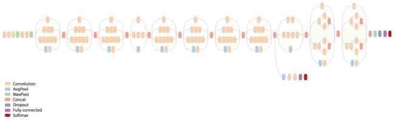
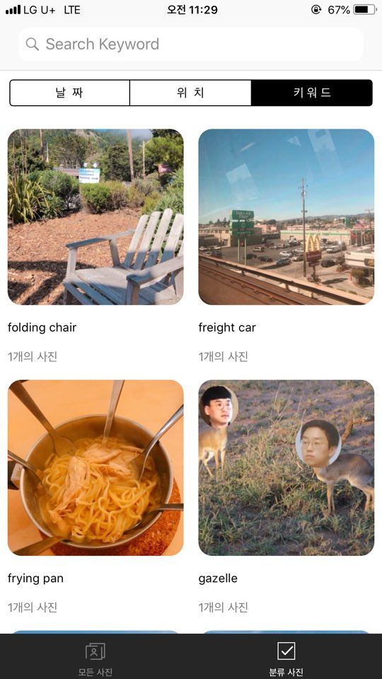

# CoreML & Vision #


### 딥러닝 ###

1950년대 이래로 인공지능 연구자들은 머신러닝에 대한 많은 접근방법을 개발해왔습니다. 애플의 Core ML 프레임워크는 신경망, 트리앙상블, 서포트 벡터 머신, 일반 선형 모델, feature engineering 및 파이프라인 모델을 지원합니다. 인공지능은 2012년 구글이 유튜브 동영상을 이용해 인공지능을 훈련하여 고양이와 사람을 인식하는 것에서 시작하여 최근 수많은 성공사례를 만들어내고 있습니다. 시리와 알렉사와 같은 앱도 신경 네트워크의 발전 덕분에 가능해졌습니다.
신경망은 서로 다른 방식으로 연결되어있는 노드의 레잉로 인간 두뇌의 작동 방식을 모델링하려고 합니다. 각 추가 레이어는 컴퓨팅 자원의 큰 향상을 요구합니다. 개체 인식 모델인 Inception v3은 48개의 레이어와 약 2천만개의 파라미터를 포함하고 있습니다. 그러나 게산은 기본적으로 행렬 곱셈으로 이루어지며, GPU가 이러한 계산을 매우 효율적으로 수행합니다다. GPU 가격의 하락 덕분에 많은 사람들이 멀티레이어 신경망을 만들 수 있게 되었고, 이러한 멀티레이어 신경망을 이용한 학습을 딥러닝이라고 합니다.




신경망 학습은 많은 양의 훈련 데이터를 요구하는데, 인터넷의 발전으로 인한 사용자 직접 생성 데이터의 폭증이 머신 러닝 르네상스에 기여했습니다. 모델 학습은 신경망에 학습 데이터를 입력하고 출력을 만들어내기 위해 파라미터들을 결합하는 수식을 도출해내도록 하는 것을 의미하며, 보통은 GPU가 많은 컴퓨터에서 수행합니다. 학습 된 모델에 새로운 데이터를 입력하고 모델은 출력값을 계산해 내는데, 이를 추론이라고 합니다. 추론 또한 입력값에서 산출물을 도출해내기 위해 많은 컴퓨팅이 필요하며, 애플의 Metal과 같은 프레임워크를 이용하면 스마트폰에서도 이러한 계산을 수행할 수 있게 됩니다. 그러나 모든 표본을 대표할 수 있는 학습표본을 만들어내는 과정이 쉽지 않기 때문에 아직 딥러닝은 완벽하지 않습니다.

***

### 애플이 제공하는 것 ###

애플은 iOS5에서 자연어 분석을 위한 NSLinguisticTagger를 발표했습니다. iOS8에서는 기기의 GPU에 낮은 레벨의 접근이 가능하도록 해주는 Metal 프레임워크를 발표했습니다.

그 이후에는 CoreML, Vision 등을 발표 중에 있습니다. 지금까지 Apple은 Google이나 Microsoft들로부터 기계 학습 분야에서 다소 뒤쳐지고 있다는 인상이 있었지만, CoreML의 도입으로 적지 않은 iOS 개발자들에게 새로운 모멘텀이 증가하기 때문에 앞으로 Apple의 움직임이 주목됩니다.


Core ML은 애플리케이션에 학습된 (Pre-trained) 모델을 아주 쉽게 사용할 수 있도록 해줍니다. (추가적으로 학습이 불가능하다는 한계가 있...) CoreML 추론 환경으로, 학습 환경이 아니기 때문에 학습 자체는 Keras, Caffe과 csikit-learn 등 다른 프레임 워크에서 해야합니다.


Vision을 사용하면 얼굴, 랜드마크, 텍스트, 사각형, 바코드 및 다양한 객체를 감지하는 애플의 모델을 사용할 수 있니다. 고성능 이미지 분석 및 컴퓨터 비전을 사용하여 얼굴을 식별하고 기능을 발견하고 사진이나 비디오 장면을 분류하기위한 라이브러리라고 말할 수 있습니다..

이러한 프레임워크는 Metal을 기반으로 하여 장치 내에서 효율적으로 수행되기 때문에, 별다른 서버통신이 필요없습니다.

***
[Apple’s Developer Website on Machine Learning](https://developer.apple.com/machine-learning/build-run-models/) 사이트에서 미리 train된 모델들 (.mlmodel)을 받아 사용할 수 있습니다.
~~(그러나 정확도는 누구도 보장해주지 않습니다.)~~


CoreMLl과 Vision을 사용한 예시

1. 이미지 키워드 분석
2. 실시간 얼굴 인식 및 감정 분석

***

### 1. 이미지 키워드 분석

해당 모델을 Xcode Project에 넣고 해당 모델에 대한 객체를 선언합니다.

```swift
import CoreML
import Vision

var mobileModel: VNCoreMLModel?
    init() {
        do {
            mobileModel = try VNCoreMLModel(for: MobileNet().model)
        } catch {
            fatalError("Failed to load Vision ML model: \(error)")
        }
    }
```
해당 모델에 대하여 VNCoreMLRequest를 통해 분석을 진행합니다.

```swift
let request = VNCoreMLRequest(model: model, completionHandler: { [weak self] request, error in
               self?.processClassifications(for: request, error: error)
           })


/// - Tag: ProcessClassifications
   func processClassifications(for request: VNRequest, error: Error?) {
       DispatchQueue.main.async {
           guard let results = request.results else {
               self.classificationLabel.text = "Unable to classify image.\n\(error!.localizedDescription)"
               return
           }
           // The `results` will always be `VNClassificationObservation`s, as specified by the Core ML model in this project.
           let classifications = results as! [VNClassificationObservation]

           if classifications.isEmpty {
               self.classificationLabel.text = "Nothing recognized."
           } else {
               // Display top classifications ranked by confidence in the UI.
               let topClassifications = classifications.prefix(2)
               let descriptions = topClassifications.map { classification in
                   // Formats the classification for display; e.g. "(0.37) cliff, drop, drop-off".
                  return String(format: "  (%.2f) %@", classification.confidence, classification.identifier)
               }
               self.classificationLabel.text = "Classification:\n" + descriptions.joined(separator: "\n")
           }
       }
   }
```
해당 request의 분석값을 이용합니다.

```Swift
/// - Tag: PerformRequests
    func updateClassifications(for image: UIImage) {
        classificationLabel.text = "Classifying..."

        let orientation = CGImagePropertyOrientation(image.imageOrientation)
        guard let ciImage = CIImage(image: image) else { fatalError("Unable to create \(CIImage.self) from \(image).") }

        DispatchQueue.global(qos: .userInitiated).async {
            let handler = VNImageRequestHandler(ciImage: ciImage, orientation: orientation)
            do {
                try handler.perform([self.classificationRequest])
            } catch {
                /*
                 This handler catches general image processing errors. The `classificationRequest`'s
                 completion handler `processClassifications(_:error:)` catches errors specific
                 to processing that request.
                 */
                print("Failed to perform classification.\n\(error.localizedDescription)")
            }
        }
    }
```

<br>

해당 예시를 활용하여 만든 키워드 분석 앨범입니다.
~~(가젤이긴 한데...)~~



<br>

### 2. 실시간 얼굴 인식 및 감정 분석

실시간 얼굴인식을 위하여 ARSCNView을 이용하였으며, 해당 view의 cvPixelBuffer를 토대로 Vision을 이용해 얼굴인식을 요청하여 관찰값을 받습니다.

```Swift
guard let frame = self.scnView.session.currentFrame else {
                print("No frame available")
                observer.onCompleted()
                return Disposables.create()
            }
            // Create and rotate image

            let image = CIImage.init(cvPixelBuffer: frame.capturedImage).rotate
            let facesRequest = VNDetectFaceRectanglesRequest { request, error in
                guard error == nil else {
                    print("Face request error: \(error!.localizedDescription)")
                    observer.onCompleted()
                    return
                }
                guard let observations = request.results as? [VNFaceObservation] else {
                    print("No face observations")
                    observer.onCompleted()
                    return
                }
                // ------------------------------
               // Draw Detection Box
               DispatchQueue.main.async {
                   for subview in self.scnView.subviews {
                       subview.removeFromSuperview()
                   }
               }
               self.drawVisionRequestResults(results: observations)

```

인식된 얼굴들에 대하여 우선 하나의 얼굴에 대해서만 CNNEmotions mlmodel로 감정을 분석하고 해당 얼굴 프레임과 함께 표시합니다.

``` Swift
if let result = results.first {
            ////
            guard let frame = self.scnView.session.currentFrame else { return }
            let image = CIImage.init(cvPixelBuffer: frame.capturedImage).rotate.cropImage(toFace: result)
            let request = VNCoreMLRequest(model: self.model) { request, error in
                guard let emotions = request.results as? [VNClassificationObservation],
                    let topResult = emotions.first else {
                        fatalError(error.debugDescription)
                }
                DispatchQueue.main.async {
                    let face = Face(frame: self.faceFrame(from: result.boundingBox), emotion: topResult.identifier)
                    for subview in self.scnView.subviews {
                        subview.removeFromSuperview()
                    }
                    let view = face.getView()
                    self.scnView.addSubview(view)
                }
            }
            DispatchQueue.global(qos: .userInitiated).async {
                let handler = VNImageRequestHandler(ciImage: image,  options: [:])
                do {
                    try handler.perform([request])
                } catch {
                    print("Failed to perform classification.\n\(error.localizedDescription)")
                }
            }
        }
```
RxSwift를 통하여 0.3초마다 재요청하여 얼굴 및 감정을 인식합니다.

```Swift
Observable<Int>.interval(0.3, scheduler: SerialDispatchQueueScheduler(qos: .default))
            .subscribeOn(SerialDispatchQueueScheduler(qos: .background))
            .concatMap{ _ in  self.faceObservation() }
            .flatMap{ Observable.from($0) }
            .subscribe().disposed(by: disposeBag)
```

해당 튜토리얼을 활용하여 만든 실시간 얼굴 및 감정 인식 예시입니다.
~~(항상 화났다고 분석하곤 합니다.)~~

하나의 얼굴에 대해서 실시간 얼굴인식 및 감정분석


***

### 한계 ###

그러나 앞서 말하였듯이 모든 표본을 대표할 수 있는 학습표본을 만들어내는 과정이 쉽지 않기 때문에 아직 딥러닝은 완벽하지 않습니다. 때문에 CoreML 분석은 매우 부정확할 가능성이 높습니다. 그러나 이는 코드의 문제라기 보다는 애플의 trained model의 문제입니다. 이를 해결하기 위해서는 특정상황에서 쓰일 수 있도록 특정한 모델을 만들어 사용하는 등의 trained model 차원에서의 접근이 필요합니다.
