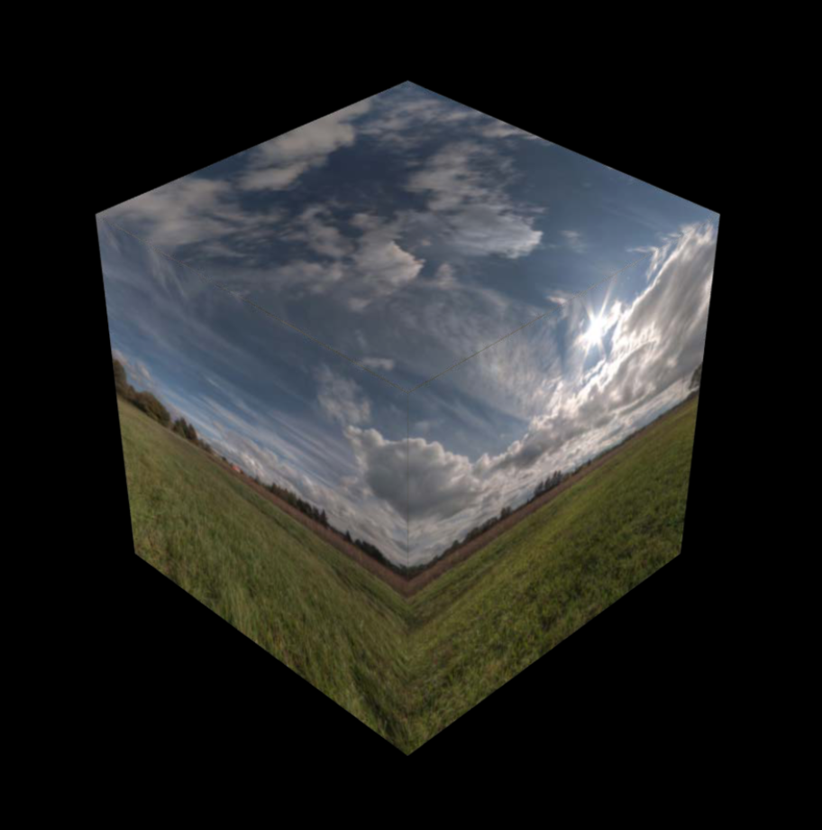
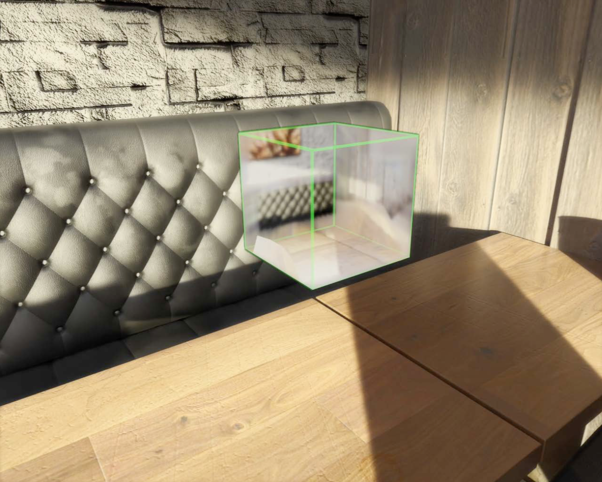

# Environment Texturing #



Environment texture는 scene의 특정 지점에서 모든 방향으로 뷰를 묘사하는 cube-map texture입니다. 3d asset rendering에서, environment texture는 표면들이 사실적으로 주변 환경으로부터 빛을 반사할 수 있는 이미지 기반 lighting 알고리즘의 기본 요소입니다. ARKit는 카메라 이미지를 사용하여, ARKit는 카메라 이미지를 사용하여, AR 세션 동안에 environment texture를 생성할 수 있으므로, ScenKit 혹은 다른 커스텀 렌더링 엔진이 AR에서 가상 객체에 사실적인 이미지 기반 lighting을 제공할 수 있습니다.


아래의 이미지는 Environment Texturing을 한 예시입니다.




아래의 코드는 Envrionment Texturing을 하는 예시 코드입니다.

```swift
// Environment Texturing

// Create world tracking configuration
let configuration = ARWorldTrackingConfiguration()

// Enable automatic environment texturing
configuration.environmentTexturing = .automatic

// Run the configuration
session.run(configuration)
```


## ARWorldTrackingConfiguration.EnvironmentTexturing ##

world-tracking ARsession의 environment texture 생성하는 옵션.

| Options | Description |
|:--------|:--------|
|**none** | ARKit이 environment map texture를 생성하지 않습니다.|
|**manual** | ARKit은 명시적으로 세션에 추가하는 probe anchor에 대해서만 environment texture를 생성합니다.|
|**automatic** | ARKiet은 언제 어디에 environment texture들을 생성할지 자동적으로 결정합니다.|

- **menual environment texturing**을 사용할 경우, AREnvironmentProbeAnchor 객체를 생성하고 세션에 추가함으로써, light probe texture map들을 원하는 scene의 점들을 식별할 수 있습니다.
- **automaic environment texturing**을 사용할 경우, ARKit은 자동적으로 AREnvironment ProbeAnchor 객체를 생성, 위치시키고 세션에 추가합니다.

이 두 경우에, ARKit은 세션이 카메라 형상을 수집함으로써, 자동적으로 environment texture들을 생성합니다. **session(_:didUpdate:)** 델리게이트 메소드를 사용하여, 언제 texture가 사용가능한지 알아내고, anchor의 environmentTexture 송성에서 액세스를 합니다.

## Realistic Rendering ##

앞서 설명한 것처럼, Environment texturing은 사실적인 렌더링을 합니다.

아래의 내용들은, 이러한 사실적인 묘사를 설명하는 요소들입니다.

- Position and orientation
- Scale
- Lighting
- Shadow
- **Reflection of textures**


## AREnvironmentProbeAnchor ##

요약 : world-tracking AR session의 특정 공간 영역에 대한 environmental lighting 정보를 제공하는 객체.

이 anchor는 다른 anchor들과 같은 생명주기를 가지며, SceneKit의 ARSCNView에서 사용할 수 있습니다. 또한 물리적인 크기나 빛 반영 등에 대하여 처리를 해줍니다.
