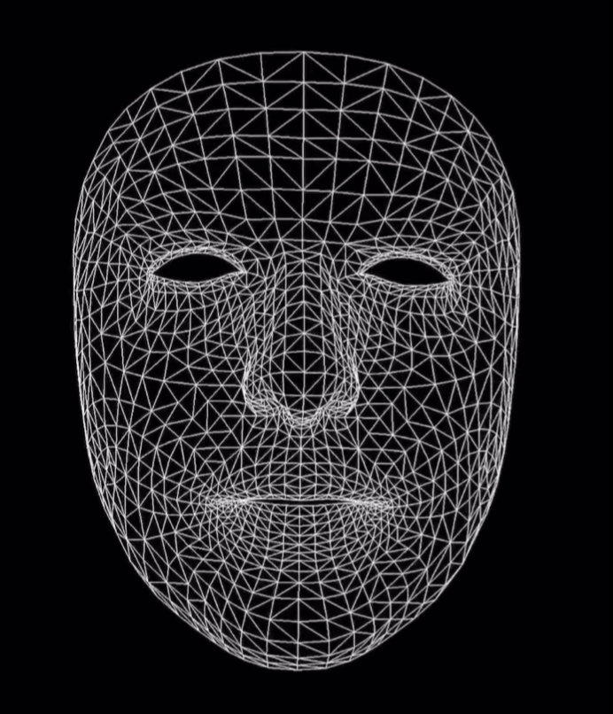
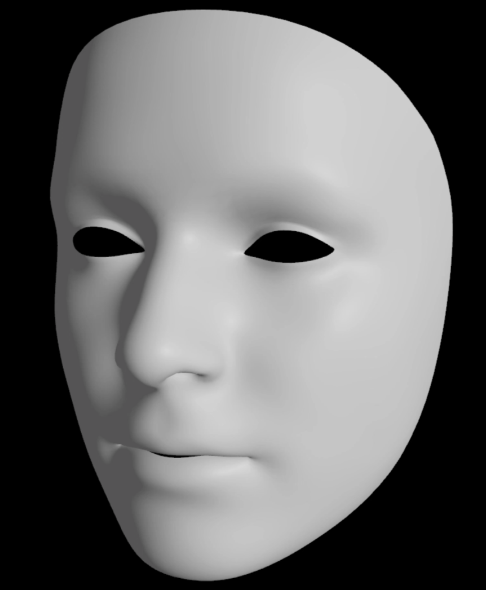

# Face Tracking Enhancements #

## Recap ##

- 강력한 얼굴 탐지와 tracking
- 매 프레임마다 위치와 방향을 업데이트함.
- **ARFaceGeometry** 삼각형 그물코 모양의 집합으로 맞추어 인식합니다. 아래의 그림이 예시입니니다.




- ARFaceAnchor

face-tracking AR 세션에서 찾은 얼굴의 형태, 위상, 표현 등에 대한 정보.


## Directional Light Estimation ##

빛이 비추는 방향에 따라 얼굴에 나타나는 그림자, 밝기 등입니다.

아래는 예시입니다.



## Blendshapes Recap ##

표현들을 실시간으로 추적할 수 있습니다.

50가지 이상의 표현들을 tracking 합니다.

이러한 blend 모양들은 0 ~ 1사이의 값을 취합니다.


## Face Tracking Enhancements ##

### Gaze tracking ###

tracking을 하여, 사람이 응시하는 곳, 왼쪽/ 오른쪽 눈의 변화를 추적하여 보여줍니다.

```swift
open class ARFaceAnchor : ARTrackable {

	open var leftEyeTransform: simd_float4x4 { get }

	open var rightEyeTransform: simd_float4x4 { get }

	open var lookAtPoint: simd_float3 { get }
}
```


### Tongue support ###

혀가 나오는지에 대한 인식을 합니다.

```swift
extension ARFaceAnchor.BlendShapeLocation {

    public static let tongueOut:
            ARFaceAnchor.BlendShapeLocation

}
```
