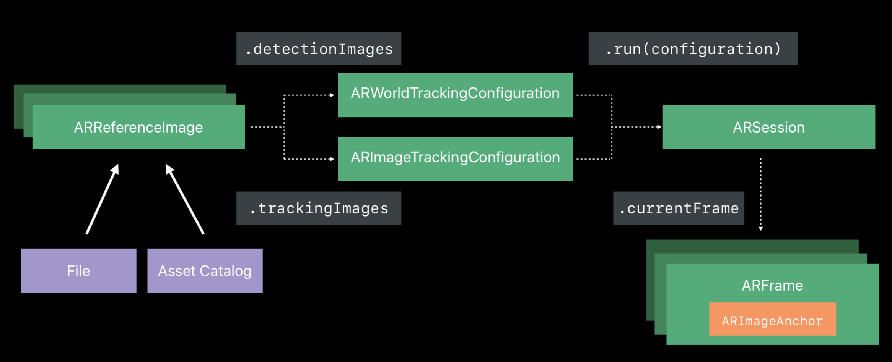

# Image Tracking #

## ARKit1 Recap ##

- 알고 있는 정적인 2D 이미지에 대한 인지
- 위치와 방향을 알 수 있음.
- world tracking에 통합됨.
- Xcode asset catalog에 의해 제공됨.


## ARKit2에서의 변화 ##

- 이미지는 더 이상 정적일 필요가 없습니다. 이미지를 움직여도 인지가 가능합니다.
- 매 프레임(1초당 60 프레임)마다 위치와 방향을 가져옵니다.
- 여러 이미지에 대하여 동시에 tracking할 수 있습니다.


## Image Tracking 로직 ##



1. File 혹은 Asset 카탈로그로부터 ARReferenceImage를 만듭니다.
2. 각 Configuration에 따라(ARWorldTrakcing - detectionImages, ARImageTracking - trackingImages) 설정을 해줍니다.
3. ARSession에 configuration을 넣어 실행합니다.
4. 현재의 프레임을 보면, ARFrame 내에 ARImageAnchor라는 객체(이미지가 발견되었다는)가 생성됩니다.

### ARImageAnchor ###

world-tracking AR session에서 발견된 이미지의 위치와 방향에 대한 정보.

아래의 코드는 ARImageAnchor에 대한 소스 코드입니다.

```swift
open class ARImageAnchor : ARAnchor, ARTrackable {
	public var isTracked: Bool { get }

	open var transform: simd_float4x4 { get }

	open var referenceImage: ARReferenceImage { get }
}
```

- isTracked		: tracking을 하는지 여부를 판단.
- transform		: 탐지된 이미지에 대한 위치, 방향 등에 대하여 알려주는 4 x 4 행렬.
- referenceImage : 발견된 이미지(ARReferenceImage 객체)


### Image tracking시의 configuration(WorldTracking, ImageTracking) ###

ARWorldTrackingConfiguration

- Image anchors in world reference frame

이미지의 anchor는 현실 세계의 좌표계로 표현됩니다.

카메라와 현실 세계의 좌표상의 원점은 모두 나타나게 됩니다.

- Detected images can be tracked(***iOS 12.0 Beta***)

이전에 탐지된 이미지들은 tracking 될 수 있습니다.

아래는 WorldTrackingConfiguration으로 실행하는 코드입니다.

```swift
// Image Tracking

// Create a world tracking configuration
let configuration = ARWorldTrackingConfiguration()

// Set of images to be detected
configuration.detectionImages = [catPhoto, dogPhoto, birdPhoto]

// Optionally specify the maximum number of images to track in parallel
configuration.maximumNumberOfTrackedImages = 2

// Run the session
session.run(configuration)
```


ARImageTrackingConfiguration(***iOS 12.0 Beta***)

- Independent from world tracking

tracking을 수행하기 위한 motion sensor에 의존하지 않습니다.

이 의미는, 이 configuration은 이미지들을 확인하려 시작하기 전까지는 초기화되지 않고, 또한 이것은 **world tracking이 실패하는 상황에 대해서도 성공**할 수 있습니다.(예를 들어 움직이는 엘리베이터나 열차 내에서도 가능합니다.)

- Position and orientation for every frame.

매 프레임(초당 60 프레임)마다 위치와 방향에 대해서 측정합니다.

```swift
// Image Tracking

// Create an image tracking configuration
let configuration = ARImageTrackingConfiguration()

// Set of images to be tracked
configuration.trackingImages = [catPhoto, dogPhoto, birdPhoto]

// Optionally specify the maximum number of images to track in parallel
configuration.maximumNumberOfTrackedImages = 2

// Run the session
session.run(configuration)
```


#### maximumNumberOfTrackedImages ####

위의 예시 코드들에서 알 수 있듯이, configuration 설정부터 image들을 세팅하는 부분까지 차이는 거의 없지만, 차이가 있다면

**maximumNumberOfTrackedImages**가 서로 다릅니다.

**ARImageTrackingConfiguration**

정의 : 움직임을 동시에 추적할 수 있는 최대 이미지 갯수.

default값이 1이며, 만약 설정한 최대 tracking하는 이미지보다 많다면, tracking이 사라지거나, 다른 이미지가 제거 될때까지, 기존에 tracking하던 이미지들을 계속 tracking 합니다.

**ARWorldTrackingConfiguration**

정의 : 움직임을 동시에 추적할 수 있는 최대 발견된 이미지의 갯수.

default값이 0이며, 0보다 클 경우에 image tracking이 가능해집니다.

발견된 이미지가 그것과 연관된 실제 객체가 현실 세계로 이동하여도 계속해서 tracking합니다. 만약 설정한 최대값보다 더 많이 보인다면, tracking이 사라지거나, 다른 이미지가 제거 될때까지, 기존에 tracking하던 이미지들을 계속 tracking 합니다.

**적은 수의 이미지만 동시에 tracking**할 수 있습니다. 더 많은 이미지를 tracking 하려면 **ARImageTrackingConfiguration**를 사용해야 합니다.
