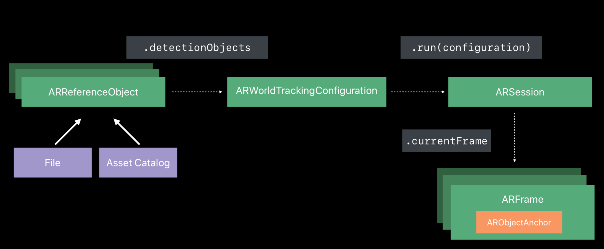
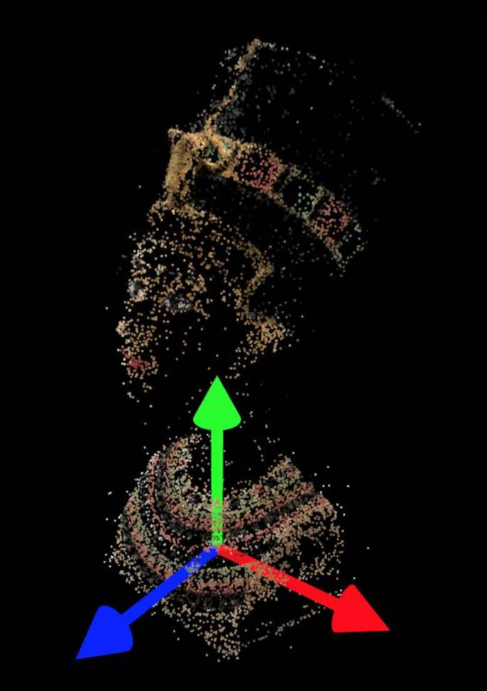

# Object Detection #

## 특징 ##

- Detection of a known static 3D object

이미 인지하고 있는 멈춰있는 상태의 3D 객체를 찾는 것입니다. (움직이는 3D 객체에는 사용할 수 없습니다.)

- Objects need to be scanned first

해당 객체는 먼저 스캔이 되어야합니다.


- Well-textured, rigid, non-reflective

인식이 잘되게 특징을 잡을 만한 좋은 질감?과 단단하고, 반사가 일어나지 않는 객체를 써야 좋습니다.


- position and orientation

위치나 방향 등에 대해서도 측정이 됩니다.


- Integrated into world tracking

이것들은 모두 world tracking에 통합되어 있기 때문에, property 하나만 설정해주어도, **object Detecion**을 시작할 수 있습니다.

아래의 코드는 object detection을 실행하는 코드입니다. 단 3줄이면 바로 실행 할 수 있습니다.

```swift
// Object Detection

// Create a world tracking configuration
let configuration = ARWorldTrackingConfiguration()

// Set of objects to be detected
configuration.detectionObjects = [ancientBust, clayPot]

// Run the session
session.run(configuration)
```


## Object Detection 로직 ##




1. File 혹은 Asset 카탈로그로부터 ARReferenceObject를 만듭니다.
2. ARWorldTrackingConfiguration의 detectedObjects를 설정해줍니다.
3. ARSession에 configuration을 넣어 실행합니다.
4. 현재의 프레임을 보면, ARFrame 내에 ARObjectAnchor라는 객체(Object가 발견되었다는)가 생성됩니다.


## ARObjectAnchor ##



위의 이미지는 세션 동영상에서 가져온 ARObjectAnchor에 대해 잘 나타내고 있는 이미지 입니다.

아래는 ARObjectAnchor에 대한 코드입니다.

```swift
open class ARObjectAnchor : ARAnchor {

    open var transform: simd_float4x4 { get }

    open var referenceObject: ARReferenceObject { get }

}
```

- transform		: 탐지된 객체에 대한 위치, 방향 등에 대하여 알려주는 4 x 4 행렬.
- referenceObject : 발견된 객체(ARReferenceObject)


## Object Scanning ##

- Accumulated scene information

Object Scanning은 현실 세계에서 누적된 scene 정보를 추출합니다.

**Accumulated scene information**은 평면 측정에 매우 연관이 큽니다.

평면 측정은 이 누적된 scene 정보를 사용하여, 위치의 수평 혹은 수직을 측정하는 것입니다.

결과적으로 이렇게 얻은 정보들을 통하여 3D 객체에 대한 정보를 얻습니다.

- Transform, extent, center

객체를 찾을 영역을 명확히 하기위해, transform, extend, center라는 것을 표시하였습니다.


- Supported by Xcode asset catalog

추출된 객체들은 Xcode의 asset catalog에 완전히 적용 가능합니다.

- ARObjectScanningConfiguration

스캔을 위해 따로 ARObjectScanningConfiguration라는 새로운 Configuration이 만들어졌습니다.


### ARObjectScanningConfiguration ###

요약 : 후면 카메라로 AR로 탐지를 시작해서 3D 물체를 스캔 할 때 사용하기 위해 높은 정확도의 공간 데이터를 수집하는 Configuration.

AR에서 현실세계의 3D 객체를 탐지하기 위해, ARWorldTrackingConfiguration이 해당 객체에 대해 ARReferenceObject라는 고화질 3D 스캔이 필요합니다. ARObjectScanningConfiguration으로 세션을 실행하면 객체 검색에 필요한 높은 정확도의 데이터 수집이 가능합니다. 이 구성으로 세션의 객체를 스캔 한 후 **createReferenceObject**를 호출하여 reference 객체로 사용할 세션의 내부 공간 매핑 데이터를 추출합니다.

객체 스캔 기능을 제외하면, **ARObjectScanningConfiguration은 ARWorldTrackingConfiguration과 유사**합니다. 즉, 6ODF, hit test와 평면 탐지를 지원합니다. 고정확도의 객체 스캐닝을 지원하기 위해, object-scanning 세션은 world tracking 세션의 다른 기능들을 제외시킵니다.

**경고**

```
ARObjectScanningConfiguration는 아직 개발 시나리오에서만 사용합니다.
고정확도 공간 매핑은 높은 성능과 에너지 사용을 하며,
reference 객체 스캐닝에 필요하지 않은, ARKit을 비활성화합니다.
실제 사용자에서 AR을 보여주길 원한다면, ARWorldTrackingConfiguration를 사용해야합니다.
```

### ARReferenceObject ###

요약 : world-tracking AR세션 동안에, 현실세계 환경에서 인식되는 3D 객체.


ARkit에서의 객체 탐지는 AR 세션이 알고 있는 3D 객체를 인식하게 된다면, 사용자에게 AR컨텐츠를 일으키게 됩니다. 에를 들어, 앱이 미술관에서 조각을 감지하고, 가상의 큐레이터를 제공하는 것이 있습니다.

탐지를 위해 알려진 3D 객체를 제공하기 위해, ARKit를 사용하여, 현실세계 객체를 스캔합니다.
ARObjectScanningConfiguration을 사용하는 AR 세션을 실행하여, 높은 정확도의 공간 매핑 데이터를 수집할 수 있습니다.

이 세션에서, 기기 카메라를 다양한 각도에서 현실세계 객체로 향하게 하면 ARKit이 객체와 그 주변의 내부의 지도를 만들 수 있습니다.

인식할 객체를 나타내는 세션의 세계 좌표 공간 부분을 결정하고, 객체 인식에 사용할 수 있도록 ARReferenceObject로 해당 부분을 가져 오려면 **createReferenceObject** 를 호출합니다.

나중에 다른 곳에서 사용할 reference 객체를 저장하려면, **export(to:previewImage)** 를 사용하여, .arobject파일을 만듭니다.

AR 세션에서 객체들을 탐지하려면, 세션 객체의 **detectObjects** 속성에 reference 객체 콜렉션을 전달해야합니다.

**refence 객체를 앱에 넣으려면, Xcode 프로젝트의 애셋 카탈로그를 사용해야합니다.**

애셋 카탈로그에서 추가 버튼을 사용하여, AR 리소스 그룹을 만듭니다.

.arobject를 리소스 그룹으로 끌어 넣어서, 애셋 카탈로그에 AR reference 객체 항목을 만듭니다.
