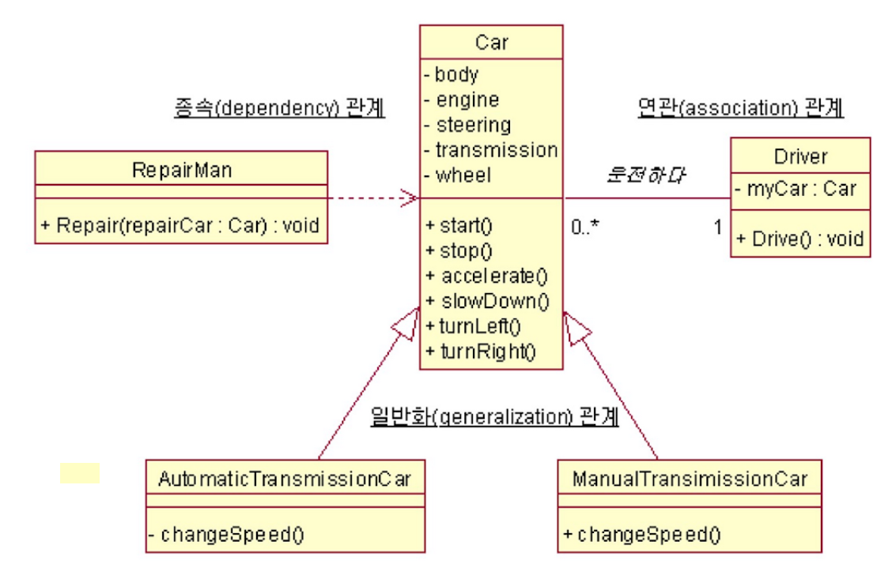
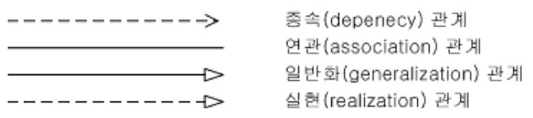

# Dependency Inversion Principle (의존 역전 원칙)

이 원칙이 말하는 바는 크게 두 가지로 요약할 수 있습니다.

1.  상위 모듈은 하위 모듈에 의존해서는 안된다. 상위 모듈과 하위 모듈 모두 추상화에 의존해야 한다.

2.  추상화는 세부 사항에 의존해서는 안된다. 세부사항이 추상화에 의존해야 한다.

이 원칙은 '상위와 하위 객체 모두가 동일한 추상화에 의존해야 한다'는 객체 지향적 설계의 대원칙을 제공합니다.

여기에서 의존 관계란 무엇인지 짚고가야할 필요성이 있습니다.

## 객체들의 관계 패턴

객체지향설계는 객체를 구별하고, 관계를 구성하는 표현하는 것입니다. 객체 즉, 클래스의 인스턴스 혼자서는 아무런 의미가 없습니다. 여러 객채들 간의 관계를 잘 활용할 때 객체지향설계를 성공적으로 했다고 말할 수 있을 것 입니다. 운전자, 정비사, 자동차, 바퀴 등등의 객체를 예시로 생각할 때 각각의 객체의 관계를 생각하지 않고서는 올바르게 모델링을 할 수 없습니다. 이러한 객체간의 관계는 아래와 같이 크게 4가지로 나눌 수 있습니다.

- 1. 의존(Dependency) 관계

- 2. 연관(Association) 관계

  - 2.1 일반 연관 관계

  - 2.2 집합(Aggregation) 연관 관계

  - 2.3 구성(Composition) 연관 관계

- 3. 일반화(Generalization) 관계 (= 상속[Inheritance] 관계)

- 4. 실현(Realization) 관계

위의 관계를 운전사, 정비사, 자동차 등의 예시에 빗대어 UML로 표현하면 아래와 같습니다.

### 1. 의존(Dependency) 관계

의존 관계는 **한 클래스 객체의 메소드에서 다른 클래스 객체를 사용하는 관계** 를 말합니다. 클래스의 속성으로 존재하는 것이 아닌, 메소드에 포함되기 때문에 레퍼런스 지속 시간이 일시적입니다. 연관관계와 가장 큰 구분되는 기준 역시 참조하는 클래스 인스턴스의 레퍼런스를 계속 유지하는가, 아니면 일시적인가 입니다. 주로 다음과 같은 세 가지 경우에 의존 관계로 표현합니다.

1. 한 클래스의 메소드가 다른 클래스의 객체를 인자로 받아 그 메소드를 사용한다.( 가장 일반적 )
2. 한 클래스의 메소드가 또 다른 클래스의 객체를 반환한다.
3. 다른 클래스의 메소드가 또 다른 클래스의 객체를 반환한다. 이때 이 메소드를 호출하여 반환되는 객체의 메소드를 사용한다.

위의 예시에서 정비사는 수리하다 라는 서비스를 수행할 목적으로 자동차를 사용합니다. 이 경우, 자동차의 사양이 바뀌면 정비사가 자동차를 수리하는 행위에 영향을 받게 되지만 자동차는 어떤 정비사에게 수리되는지 상관하지 않습니다. 즉, 정비사는 자동차를 일방적으로 사용한다고 볼 수 있습니다. 이러한 정비사와 자동차 사이의 관계를 의존 관계라고 합니다. (정비사 ---> 자동차)

또한 운전자가 일시적으로 정비사를 고용하여 자동차를 수리하기 때문에 운전자와 정비사의 관계 역시 의존 관계라고 볼 수 있습니다. (운전자 ---> 정비사)

### 2. 연관(Association) 관계

연관 관계는 **한 클래스 객체에서 다른 클래스 객체를 포함하는 관계** 를 말합니다.

이러한 연관관계에서 중요하게 볼 점은 **연관 관계의 방향성( navigability ) 과 다수성( multiplicity )** 입니다. 방향성은 클래스 사이의 결합성을 이해할 수 있는 좋은 수단이 됩니다. 양방향적인 연관 관계는 결합성이 높다는 것을 의미하며, 단방향적인 연관 관계는 결합성이 낮다는 것을 의미합니다. 다수성은 관계 맺는 객체의 수를 표현합니다. 운전자와 자동차가 1대1 관계일수도 있지만, 운전자가 자동차가 없을 수도 있고, 여러 대의 자동차를 가질 수도 있다는 것을 의미합니다.

위의 예시를 살펴보면, 대부분의 어떤 특정한 운전자는 어떤 특정한 자동차와 관계를 맺게 됩니다. 이 경우, 운전자를 알고 있으면 그 운전자의 자동차를 알 수 있고, 그 반대도 가능합니다. 즉, Attribute의 개념으로 접근할 수 있다고 볼 수 있습니다.

#### 2.1 일반 연관 관계

위의 일반적인 연관 관계입니다. 그러나 조금 특별한 연관 관계가 존재합니다. 예로 자동차와 부품들(엔진, 타이어 등)을 말할 수 있습니다. 자동차가 전체라면 이러한 부품은 부분 즉, **전체-부분 (whole-part)관계** 가 성립합니다. 이러한 특수 연관 관계를  **Life Cycle** 과 관련하여 크게 집합과 구성의 2가지 관계로 나눌 수 있습니다.

#### 2.2 집합(Aggregation) 연관 관계

집합 연관 관계는 전체-부분 관계가 성립하는 연관 관계 중 **관계 맺는 두 클래스 인스턴스 생명 주기가 같지 않은 관계** 를 말합니다. 예시로 설명하자면, 타이어는 자동차의 일부이며, 하나의 자동차에는 4개의 타이어가 포함되어 있습니다. 타이어는 소모품이므로 자주 교체될 수 있습니다.

#### 2.3 구성(Composition) 연관 관계

집합 연관 관계는 전체-부분 관계가 성립하는 연관 관계 중 **관계 맺는 두 클래스 인스턴스 생명 주기가 같은 관계** 를 말합니다. 예시로 설명하자면, 엔진을 이야기 할 수 있습니다. 엔진도 자동차를 구성하는 부분이라는 점에서 타이어와 같지만, 자동차에서 엔진을 교체하는 경우는 거의 없기 때문에 대부분 자동차와 운명을 같이합니다.

### 3. 일반화(Generalization) 관계

일반화 관계는 **한 클래스가 슈퍼클래스를 상속받아 구조와 행위를 공유하는 관계** 를 표현합니다. 자동차라는 슈퍼클래스를 승용차, 승합차, 화물차 클래스가 상속받는 것이 그 예시입니다.

### 4. 실현(Realization) 관계

실현 관계는 **한 클래스가 인터페이스의 명세를 구현하는 관계** 를 말합니다. 실현 관계는 객체지향의 다형성을 지원하는 수단이 됩니다.

## DIP

위의 의존 관계에 대한 설명으로 생각할 때, 의존 역전 원칙을 더 깊이 이해할 수 있을 것 입니다. 위의 정비사와 자동차의 관계를 다시 예로 들고자 합니다. 정비사는 추상적으로 자동차를 정비하는데 어떤 경우에는 승합차를, 어떤 경우에는 승용차를, 어떤 경우에는 화물차를 정비할 것 입니다.

이때 구체적인 자동차(승용차, 승합차, 화물차 등)은 변하기 쉬운 것이고 정비사가 자동차를 정비한다는 관계는 (정비사가 정체성을 바꾸지 않는 이상) 변하기 어려운 것입니다.

즉, 올바르게 의존 역전 원칙을 지키려면 정비사는 승용차나, 승합차, 화물차에 의존하는 것이 아닌 "자동차"라는 추상화된 인터페이스에 의존해야 하는 것 입니다.

다시 말해, 이러한 의존 역전 원칙의 key point는 "자신보다 변하기 쉬운 것에 의존하지 마라."라고 할 수 있습니다. 자신보다 변하기 쉬운 것에 의존하던 것을 추상화된 인터페이스나 상위 클래스를 두어 변하기 쉬운 것의 변화에 영향받지 않게 하는 것 이 의존 역전 원칙입니다.

## DIP의 위배

만약 위의 예시에서 정비사가 승용차에 의존한다면, 정비할 자동차의 타입이 바뀔 때마다 코드를 계속 수정해주어야 할 것입니다. 즉, DIP의 위반이 OCP의 위반을 초래하는 결과를 가져올 가능성이 높습니다. 

### Reference:

- https://digndig.kr/java/875/

- https://books.google.co.kr/books?id=Nh-OAgAAQBAJ&pg=PT85&lpg=PT85&dq=%EA%B0%9D%EC%B2%B4%EC%A7%80%ED%96%A5+multiplicity&source=bl&ots=NoV1bXoh9u&sig=4Ao2lLKT88klT2NKa73XP75drt4&hl=ko&sa=X&ved=2ahUKEwjgyKvvv9vdAhVVFogKHSPADRUQ6AEwAnoECAcQAQ#v=onepage&q=%EA%B0%9D%EC%B2%B4%EC%A7%80%ED%96%A5%20multiplicity&f=false
