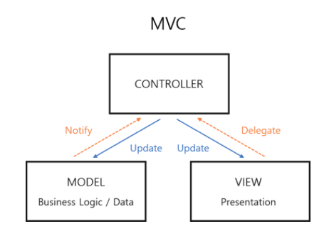

# MVC (Model + View + Controller)

MVC는 가장 대표적인 아키텍쳐 패턴으로서, Model과 View, 그리고 Controller 세가지 요소로 구성 되어 있습니다.

## Model
>Model Objects Encapsulate Data and Basic Behaviors

Model은 프로그램의 비즈니스 로직이나 데이터를 불러오거나 업데이트 하는 로직을 담당합니다. Model은 앱내의 데이터를 가지고 있으며, 그 데이터를 처리하는 방식에 대한 로직을 가지고 있습니다. 그래서 앱에서 어떤 데이터가 로딩되기 위해선 반드시 Model 객체를 거쳐야만 합니다. Model은 화면에 직접적으로 데이터를 로딩하는 역할을 하지 않습니다. 그래서 Model은 view와 직접적으로 연관이 없도록 디자인해야 합니다. 예를 들어 Person 객체의 생일과 관련한 데이터를 화면에 로딩한다고 할 때, 생일정보는 Model에 있지만, 그 생일이 화면에 표현되는 것은 모델이 관리하지 않습니다.

Model에 속하는 객체들은 다음과 같습니다.

- Network Code - 네트워크의 커뮤니케이션을 관리하는 객체(NetworkManager의 형태)
- Persistence Code - CoreData, Realm에 저장되는 객체(디스크에 저장)
- Parsing Code - 네트워크의 response를 통해 생성되는 객체

## View

> View Objects Present Information to the User

View는 실제 사용자가 눈으로 보는 모든 객체들을 다룹니다. View는 어떻게 보여질지에 대해서만 관장하고, 어떤 데이터를 보여줄지에 대해서는 알지 못합니다.  View는 보통 재사용이 가능하며, 수정할 수 있고, 앱 사이의 일관성을 제공합니다.

## Controller

> Controller Objects Tie the Model to the View

Controller는 Model과 View 사이의 중간자 역할로서, 사용자는 컨트롤러를 사용하여 모델의 상태를 바꾸고, 그에 따른 뷰를 보여줍니다. Controller는 또한 앱의 환경설정을 담당하고, 다른 객체들의 life cycle을 관리합니다.

Controller는 다음과 같은 일을 하는 것들입니다.

- What should be accessed first: the persistence or the network?
- How often should you refresh the app?
- What should the next screen be and in what circumstances?
- If the app goes to the background, what should be cleaned?

Model과 view는 서로 대화할 수 없고, 각각은 controller와 상호 소통합니다.

-	> Controller -> View
먼저 Controller는 IBOutlet 등을 통해 View에게 어떤 데이터를 보여줄지 구체적인 지시를 하게 됩니다.

-	> View -> Controller
View는 유저 인터렉션의 상황에서 데이터 업데이트를 위해 IBAction이나 Datasource, Delegate를 통하여 Controller와 소통합니다.

-	> Controller -> Model
유저 인터렉션 등으로 인한 데이터 업데이트를 위하여 Controller는 Model class의 Instance를 만들어 Model 업데이트를 수행합니다.

-	> Model -> Controller
데이터가 변하여 컨트롤러가 뷰를 업데이트 해야하는 경우, 모델은 KVO와 Notification을 수행하여 컨트롤러와 소통합니다.

MVC는 이해하기 쉽고 생산성이 매우 좋습니다. 그러나 iOS의 MVC는 Model-View-Controller의 분리가 완전하지 않아서 Model에 넣기도 애매하고 View에 넣기도 애매한 코드들이 모두 Controller에 위치하게 되기 때문에 Controller의 크기가 지나치게 커지는 경향이 있습니다. 이를 Massive View Controller 문제라고도 합니다.
