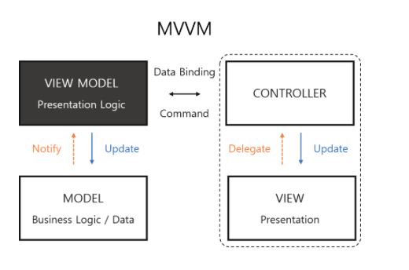

# MVVM (Model-View-View Model)



MVVM 패턴을 그림으로 형상화하면 위와 같습니다. Controller는 더이상 Model에게 직접 명령하지 않고, Presentation Logic을 담당하는 View Model을 따로 두어 이를 통해 소통합니다. MVVM은 아래와 같은 몇 가지 규칙을 따릅니다.

- Model은 다른 클래스들이 데이터 변경에 대한 notification을 내보내더라도 이들과 직접 통신하지 않는다.
- View Model은 Model과 통신하며 여기서의 데이터들을 ViewController로 내보낸다.
- View Controller는 View 생명주기를 처리하고 데이터를 UI 구성요소에 바인딩 할 때만 View Model 및 View와 통신한다.
- (MVC 패턴에서처럼) View는 이벤트에 대해서만 View controller를 인식한다.


MVVM은 이처럼 각 단위가 독립적으로 작성되고 테스트 될 수 있게 설계된 패턴입니다.

이 View Model은 View와 Data Binding을 통해 연결되어 있습니다. ViewModel은 유저 인터렉션의 상황에서 명령을 받아 Model에 변화를 주고 업데이트를 하는데, View와 연결된 데이터 바인딩으로 인해 View도 자연스레 업데이트됩니다. ViewModel은 View에 대해 아무것도 모르기 때문에 테스트가 쉽고 바인딩으로 인해 코드 양이 많이 줄어듭니다.

이러한 Data Binding을 위한 객체 간 소통 방법으로서 RxSwift의 Observable 패턴을 사용하면 간결하고 강력하게 아키텍쳐를 구축할 수 있습니다.


MVVM의 장점의 매우 간단한 예시로 계좌정보의 모델이 있고, 그 계좌정보를 가공해서 보여주어야 하는 상황을 말할 수 있습니다.

모델의 데이터은 아래와 같고,

```swift
let amount = 6729383.99
```

보여주어야 하는 라벨은 다음과 같다고 가정해보겠습니다.
```swift
Your balance is $6,729,383.99
```

보통 MVC에서는 해당 데이터를 View Controller에서 통화 단위나 "Your balance is" 등의 문구를 가공하여 Label 뷰의 텍스트로 보여줍니다. 그러나 아래와 같은 뷰 모델을 통해서 데이터를 가공하고 이를 정보 뷰에 보여준다면, 각각의 출력값이 명료하기 때문에 뷰 컨트롤러나 뷰 등의 독립적 단위를 테스트하기 쉬워집니다.

```Swift
struct AccountViewModel {
    let displayBalance: String

    init(mode: BankAccount) {
        let formattedBalance = model.balance.currencyValue
        displayBalance = "Your balance is \(formattedBalance)"
    }
}
```


### Reference:
https://www.objc.io/issues/13-architecture/mvvm/
