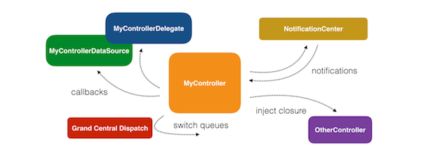

# 객체간 소통 #


## 1. 기존 객체간 소통 ##

 View와 ViewController, Model과 ViewController 등 혹은 내부의 각각의 객체들 사이에서 소통이 필요한 경우가 많습니다. 단순히 객체의 instance를 만드는 방법이 존재하지만, 한 객체는 그 자체로 존재하면서 소통하고 싶을뿐 다른 객체에 종속되어 동작하는 것은 ‘재사용성’과 ‘독립된 기능요소’ 측면에서 볼 때 바람직하지 않습니다.

 대표적으로 ViewController는 한 View를 관리하는 독립적인 객체로서 존재해야지 소통을 위해 다른 ViewController에 묶여 동작하는 것은 옳지 않은 방식입니다.

 때문에 객체들 사이에 엮이지 않으면서 Async하게 소통을 하기 위한 몇 가지 방법이 존재합니다. 공통적으로 이를 위해서는 여러 작업들이 동시에 일어나는 상황에서, 어떤 이벤트가 A에서 일어나면 B에 알려주어 적절한 조취를 취해주어야 합니다. 이를 위해서 크게 3가지의 방법이 있습니다.

 1. Callback
 2. Notification
 3. Delegation


### 1.1 Callback ###

비동기 작업이 완료되는 시점을 인지하는 Completion Handler로서 Callback Closure를 사용합니다. 함수가 자신의 작업을 모두 완료한 후 클로져를 호출한다면, async에서 작업이 완료된 시점을 인식하고 처리할 수 있습니다. 아래는 콜백 클로져의 예시입니다.

```Swift
func someFunction(someClosure: () -> ()) {
  // some codes
  someClosure()
}
```
<br>

### 1.2 Notification ###

한 객체가 다른 객체에게 자신의 업데이트 상태를 알려주는 방법 중 하나입니다. instance-to-instance communication으로 라디오 센터처럼 전파를 쏘아주는 구조로 이루어집니다. Observation 패턴 중 하나로서 MVC구조에서 Model이 Controller에게 말을 걸기 위해 사용하는 방식이기도 합니다.

비동기적으로 작업을 하는 인스턴스가 자신이 수행하는 작업을 완료하면 Notification을 통해 이를 통보하는 메시지를 보낼 수 있습니다. 루프를 통해 변화를 계속 들어야 하므로 자원적 측면에서 비효율이 존재하지만, 한 객체의 변화를 여러 객체에서 관찰해야 하는 경우 매우 유용합니다.

- #### 1.2.1 Notification center ####

> Notification Center라는 싱글턴 객체를 통해서 이벤트들의 발생 여부를 옵저버를 등록한 객체들에게 Notification을 post하는 방식으로 사용합니다. Notification name이라는 key 값을 통해 보내고 받을 수 있습니다.

```Swift
// post
NotificationCenter.default.post(name: Notification.Name("notification"), object: sendNotificationButton, userInfo: ["backgroundColor": backgroundColor])

// add observer
NotificationCenter.default.addObserver(self, selector: #selector(notificationReceived(notification:)), name: Notification.Name("notification"), object: nil)

// remove observer
NotificationCetner.default.removeObserver(self)
```

 - #### 1.2.2 KVO ####

 > A 객체에서 B 객체의 프로퍼티가 변화됨을 감지할 수 있는 패턴이다. 위의 두 패턴이 주로 Controller와 다른 객체 사이의 관계를 다룬다면 KVO 패턴은 객체와 객체 사이의 관계를 다루는데 적합합니다. 메소드나 다른 액션에서 나타나는 것이 아니라 프로퍼티의 상태에 반응하는 형태입니다. dynamic dispatch를 적용해야 합니다.

 > 두 객체 사이의 정보를 맞춰주는 것이 쉽고 new/old value를 쉽게 얻을 수 있으며 key path로 옵저빙 하기 때문에 nested objects도 옵저빙 가능하다는 장점이 있지만 NSObject를 상속받는 객체에만 사용이 가능하고, dealloc될 때 옵저버를 지워줘야 하며, 많은 value를 감지할 대는 많은 조건문이 필요하다는 단점이 있습니다.

```Swift
 someView.addObserver(self, forKeyPath: "frame", options: [.new, .old], context: &context)
```
<br>

NotificationCenter는와 KVO와의 차이점은 specificity에 있습니다. KVO는 text property와 같이 객체의 specific changes를 track합니다. 그러나 NotificationCenter는 generic events를 track 합니다. KVO는 자동적으로 이전 상태 값과 변화 값 등의 정보를 제공하지만, NotificationCenter는 유저가 명시적으로 specify한 extra metadata 만을 분출합니다.

<br>

### 1.3 Delegation ###

Delegate는 보통 Protocol을 정의하여 사용합니다. Protocol이란 일종의 기능 명세서 같은 것으로 Delegate로 지정된 객체가 해야 하는 메소드들의 원형을 적어 놓습니다. Delegate 역할을 하려는 객체는 이 Protocol을 따르며 원형만 있던 메소드들의 구현을 합니다. 이렇게 세팅 후 이전 객체는 어떤 이벤트가 일어났을 시 delegate로 지정한 객체에 알려줄 수 있습니다.

객체간 연결을 느슨하게 할 수 있고, subclassing없이 행동이나 상태를 제어할 수 있으며 임의의 객체에 대해 작업을 전달할 수 있습니다. 또한 로직의 흐름을 따라가기가 쉽고 엄격한 Syntax로 인해 프로토콜에 필요한 메소드들이 명확하게 명시되며, 커뮤니케이션 과정을 유지하고 모니터링하는 제 3의 객체(NotificationCenter 같은 외부 객체)가 필요없다는 장점 등이 있지만,

많은 줄의 코드가 필요하고 많은 객체들에게 이벤트를 알려주는 것이 어렵고 비효율적이라는 단점이 있습니다.

```Swift
// 1) Delegate 프로토콜 선언
protocol SomeDelegate {
    func someFunction(someProperty: Int)
}

class SomeView: UIView {
    // 2) 순환 참조를 막기 위해 weak으로 delegate 프로퍼티를 가지고 있음
    weak var delegate: SomeDelegate?

    func someTapped(num: Int) {
        // 3) 이벤트가 일어날 시 delegate가 동작하게끔 함
        delegate?.someFunction(someProperty: num)
    }
}
// 4) Delegate 프로토콜을 따르도록 함
class SomeController: SomeDelegate {
    var view: SomeView?

    init() {
        view = SomeView()
        // 6) delegate를 자신으로 설정
        view?.delegate = self
        someFunction(someProperty: 0)
    }

    // 5) Delegate 프로토콜에 적힌 메소드 구현
    func someFunction(someProperty: Int) {
        print(someProperty)
    }
}

let someController = SomeController()
// prints 0
```


## 2. RxSwift 이용 ##

문제는 비동기코드 관련 코드를 아우르는 하나의 패러다임이 없기 때문에, 전체적인 비동기 코드를 이해하기 힘들어집니다. 여기선 Delegate를 사용하고, 저기선 클로져를 쓰고, 저기선 또 NotificationCenter를 쓰고.. (사진참조)




RxSwift의 장점을 정리하자면 다음과 같습니다.

> 1. 다수의 비동기 이벤트에 대해 쉽게 관찰함으로써 기존 객체간 소통 (Delegation, Notification, KVO, Callback 등) 에 비해 데이터 업데이트 / 바인딩 및 이벤트 처리가 용이합니다.

> 2. 이벤트 처리에 있어서 다양한 Operator가 존재합니다. (ex) Map, Merge, TimeInterval 등...)

 > 3. 다수의 비동기 이벤트 처리를 해야하는 경우, 기존보다 용이하게 쓰레드를 관리할 수 있습니다.

<br>

요약하자면, <strong>"다수의 (비동기) 이벤트에 대해 용이한 쓰레드 관리로 여러 Operator의 형태의 객체간 소통을 지원할 수 있다"</strong> 라고 말할 수 있습니다.


RxSwift는 observer패턴의 확장인 observable이라는 객체를 사용하여 비동기적으로 값을 배출 할수 있고 이러한 1개 혹은 다수의 이벤트를 관찰하고 시퀀스로 반응함으로써 소통합니다.


> <strong> Observeable : </strong>
구독(Subscribe)당하는 오브젝트
이벤트를 시간의 흐름에 따라 전달하는 전달자

> <strong> Observer : </strong>
구독하는 오브젝트, 3가지 이벤트(next, completed, error)에 대해서만 구독 가능

> <strong> Operator : </strong>
 filter, map 등의 연산자, 여러 조합으로 다양한 결과를 도출 가능

 - [Reactive Function을 시각적으로 표현해주는 사이트](http://rxmarbles.com/ )

> <strong> Scheduler : </strong>
Dispatch queue와 비슷

> <strong> Dispose :</strong>
 Observables의 사용이 끝나면 메모리를 해제해야 합니다. 그 때 사용할 수 있는것이 Dispose입니다.


이를 통해서 하나의 방식으로 다수의 비동기 처리가 가능해지기 때문에 객체간 비동기 소통이 매우 편리해 집니다. 즉, NotificationCenter, Delegate, KVO, GCD .. 등.. Observable로 단일화 됩니다. 더불어 비동기 코드를 작성할 때 자주 발생하는 실행 순서가 보장되지 않는다는 것과 Mutable 데이터를 공유하고 있다는 점에 대해 효율적인 접근이 가능합니다.

델리게이트의 수많은 프로토콜과 더이상 부딪히지 않아도 되며, Notification Center보다 더욱 간결하고 명확하게 관찰 가능합니다.


ex)

```Swift
// Delegate: 지금 스크롤되고 있는 스크롤 뷰는 어떤 것인지?
public func scrollViewDidScroll(scrollView: UIScrollView) { [weak self]
    self?.leftPositionConstraint.constant = scrollView.contentOffset.x
}

-->

// with RxSwift
self.resultsTableView
    .rx.contentOffset
    .map { $0.x }
    .bind(to: self.leftPositionConstraint.rx.constant)
```

```Swift
// KVO: 등록되어 있는 동안 계속 할당
-(void)observeValueForKeyPath:(NSString * )keyPath
                     ofObject:(id)object
                       change:(NSDictionary * )change
                      context:(void * )context

-->

// with RxSwift
view.rx.observe(CGRect.self, "frame")
    .subscribe(onNext: { frame in
        print("Got new frame \(frame)")
    })
    .disposed(by: disposeBag)

```
