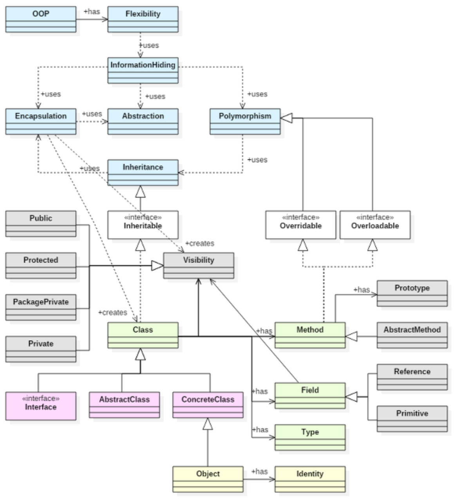

# 디자인 패턴의 기본 (SOLID)

## OOP

객체 지향 프로그래밍의 줄임말으로서, 프로그램을 어떻게 설계해야 하는지에 대한 일종의 개념이자 방법론입니다. 프로그램을 단순히 데이터와 처리 방법으로 나누는 것이 아니라, 프로그램을 수많은 '객체'라는 기본 단위로 나누고 이 객체들의 상호작용으로 서술하는 방식입니다. 객체는 하나의 '역할'을 수행하는 메소드와 데이터의 묶음입니다.

큰 문제를 작게 쪼개는 것이 아니라, 먼저 작은 문제들을 해결할 수 있는 객체들을 만든 뒤, 이 객체들을 조합해서 큰 문제를 해결하는 상향식(Bottom-up) 해결법을 도입한 것입니다. 객체란 것을 일단 한번 독립성/신뢰성이 높게 만들어 놓기만 하면 그 이후엔 그 객체를 수정 없이 재사용할 수 있으므로 개발 기간과 비용이 대폭 줄어들게 됩니다. 즉, OOP의 장점을 정리하면 아래와 같습니다.

1. 코드의 재사용성이 높다.

2. 코드의 관리가 용이하다.

3. 신뢰성이 높은 프로그래밍을 가능하게 한다.

그러나 점차 이러한 객체지향 프로그램이 복잡해지면서 이를 간결하게 정리할 필요성이 생긴 관계로 '디자인 패턴'이라는 것이 생겼습니다. 디자인 패턴이란 프로그래밍 형식을 정하는 일종의 약속으로, 이는 특히 협업을 전제로 한 환경에서 특히 강조되고 있습니다. Foundation / UIKit 등의 프레임워크들 역시 OOP를 기본으로서 Delegate 등의 여러 패턴들을 도입하였다고 볼 수 있습니다. 때문에 여러 디자인 패턴들을 깊이 이해하기 위하여 OOP에 대한 이해가 필수적입니다.

## OOP의 특징

### Abstraction 추상화

OOP의 가장 핵심적인 개념입니다. 객체에서 공통된 속성과 행위를 추출하는 것을 추상화(Abstraction)라고 합니다. 추상화 과정을 통하여 실세계 상황을 간결하고 명확하게 모델링하게 되며 구체화 과정을 통하여 추상적 모델을 프로그램으로 변환합니다. 예를 들어 사과, 배, 포도라는 객체가 있을 때 이것들을 과일으로 묶으며 추상화가 가능합니다.

OOP의 원칙 중 하나인 “코딩은 구체적인 것에 의존하지 않고 추상화된 것에 의존해야 한다.(DIP)” 역시 그 궤를 같이합니다. 추상화는 다른 객체들과 구분되는 핵심적인 특징들에만 집중함으로써, 복잡도를 관리할 수 있도록 합니다. 하나의 대상에 대하여 목적이나 원하는 기능에 따라 여러 추상화 모델이 생성될 수 있습니다.  

추상화를 통하여 이루고자 하는 목적은 두가지 입니다. 1. 어떻게 하면 실제 시스템을 간결하게 표현할 수 있는가?이고 또 다른 하나는 2. 어떻게 하면 실제 시스템의 정보를 모두 표현하는가? 입니다. 그러나 어떠한 시스템을 간결하며 자세히 표현한다는 것은 두 마리 토끼를 잡는 것과 같은 상황이기 때문에 이 목표들을 잘 조절하여 모델링을 수행하는 능력이 필요합니다.

아래의 캡슐화, 상속, 다형성 역시 추상화의 개념에 근간합니다. 예로 UITableViewCell을 상속받아 MyTableViewCell을 만든다고 가정할 때, 우리가 UITableViewCell을 상속받아 MyTableViewCell을 재정의했다고 해서 UITableView가 MyTableViewCell을 직접적으로 알아야 할 필요는 없습니다. 만일 그랬다면 MyTableViewCell을 만들면 UITableView도 재컴파일 되거나 상속받아 MyTableViewCell을 처리할 수 있게 만들어야 했을 겁니다. 단순히 UITableViewCell의 일부 기능을 재활용한 것이 아니라 우리가 cell을 마구 커스터마이징 하여도 UITableView 자체를 계속 재활용하고 있는 것입니다. 이것이 가능해지는 이유는 UITableView가 구체적인 MyTableViewCell이라는 클래스를 기반으로 동작하지 않고 추상화된 개념의 UITableViewCell을 기반으로 동작하고 있기 때문에 가능한 일입니다.

### Encapsulation 캡슐화

실제로 구현되는 부분을 외부에 드러나지 않도록 캡슐로 감싸 이용방법만을 알려주는 것 입니다. 캡슐화를 통해 데이터 구조와 데이터들은 1. 묶이고 2. 외부로부터 숨겨집니다.

먼저, 묶음으로 인해 프로그램을 바라보는 단위가 커집니다. 이전의 절차지향에서는 프로그램을 함수 단위로 구조화할 수 있으나, 프로그램 소스가 커지면 이해하기 어렵고 관리가 힘들어 질 수 있었습니다. 그러나 객체지향 프로그램에서는 프로그램 소스를 클래스 단위로 바라보게 됨으로써 좀더 복잡하고 커다란 소스코드도 쉽게 이해하게 되었습니다.
클래스 내부에 여러 함수를 내포할 수 있기 때문에 프로그램 소스 코드를 바라보는 단위가 커졌으며, 그로 인해 프로그램 관리가 좀 더 수월해진 것입니다.

두번째, 내부를 숨김으로써 내부를 좀더 자유롭게 변경할 수 있게 되었습니다. 이전의 함수 중심적인 구조적 프로그래밍 언어에서는 프로그램 내부에서 데이터가 어디서 어떻게 변경되는지 파악하기 어려웠고, 그로 인해 유지 보수가 힘들었기 때문에 자료를 중심으로 함수가 종속되는 구조가 되기도 하였습니다. 객체 지향에서는 클래스 내부의 데이터를 외부에서 참조하지 못하도록 차단하여 이러한 폐단을 없앨 수 있습니다. 이렇게 내부의 데이터나 함수를 외부에서 참조하지 못하도록 차단하는 개념을 정보 은닉Information Hiding)이라고 합니다. 캡슐화는 중요사항을 감춘 상태에서 외부에 그것을 사용할수 있는 방법을 설정하고 외부와 직접적으로 의사소통을 의미 합니다.

### Inheritance 상속

상위 개념의 특징을 하위 개념이 물려받는 것입니다. 상속을 통해 재사용으로 인한 코드가 줄어듭니다. 하위 클래스에서 속성이나 오퍼레이션을 다시 정의하지 않고 상속받아서 사용함으로써 코드가 줄어들기 때문입니다. 그리고 좀 더 범용성있게 사용할 수 있습니다. 하위 클래스는 상위 클래스가 가지고 있는 모든 자료와 메소드를 물려받아 자유롭게 사용할 수 있지만, 또한 자신만의 자료와 메소드를 추가적으로 덧붙임으로써 새로운 형태의 클래스로 발전하게 됩니다.

### Polymorphism 다형성

부모클레스에서 물려받은 가상 함수를 자식 클래스 내에서 오버라이딩 되어 사용되는 것 입니다.  웹 사전을 보면, 객체지향에서의 다형성은 '여러 클래스들이 동일한 이름의 오퍼레이션을 서비스하도록 하는 것'이라고 합니다. 이러한 다형성은 실제의 코드에서는 '하나의 클래스 내부에 같은 이름의 오퍼레이션을 여럿 정의하거나, 상위 클래스의 오퍼레이션을 하위 클래스에서 다시 정의함'으로써 구현합니다.

## OOP의 원칙: SOLID

어떻게 설계하고 코딩하는 것이 OOP에 맞게 잘 하는 것인가에 대한 고민과 연구는 오래전부터 계속 있어왔고 지금은 상당히 정리된 상태입니다. 여러 학자들이 주장한 수많은 이야기들 중에서 로버트 C. 마틴은 가장 핵심적이라고 판단 할 수 있는 5가지를 모아서 SOILD라는 이름을 붙였습니다. 각각의 문자는 두문자로 SRP, OCP, LSP, ISP, DIP를 지칭하고 있습니다. iOS의 프래임워크 뿐만 아니라 잘 설계된 대부분의 프래임워크과 코드들은 이 원칙을 따르고 있습니다. 각 원칙에 대한 더 자세한 내용은 각 원칙의 문서를 참조하시면 됩니다.

각각의 원칙들은 다음과 같습니다.

1. [Single Responsibility Principle (단일 책임 원칙)](./srp.md)

“ 한 클래스는 하나의 책임만 가져야 한다. ”는 원칙입니다.

2. [Open / Closed Principle (개방-폐쇄 원칙)](./ocp.md)

“ 확장에는 열려있으나 변경에는 닫혀 있어야 한다. ”는 원칙입니다.

확장이란 새로운 기능을 추가하는 것을 말하며 새로운 기능의 추가는 쉬워야 한다는 말입니다. 변경은 말 그대로 기존의 기능의 변경인데 닫혀있다는 말은 만일 변경이 발생하면 한 곳에서만 수정이 이루어져야(변경 지점이 닫혀있어 다른 곳에 영향을 주지 않아야 함)한다는 말입니다.

Abstract class를 상속받아 구체화된 클래스를 가지는 형태의 패턴들이 기본적으로 사용하는 원칙입니다. (변경이 발생해도 구체화된 클래스 하나만 수정하면 되어야 함)

3. [Liskov Substitution Principle (리스코프 치환 원칙)](./lsp.md)

“ 객체는 프로그램의 정확성을 깨뜨리지 않으면서 하위 타입의 인스턴스로 바꿀 수 있어야 한다. ”는 원칙입니다.

이 원칙은 개방-폐쇄 원칙과 일부 궤를 함께하고 있습니다.
하위 타입의 인스턴스로 바꿀 수 있어야 한다는 이야기는 실제로 하위 타입으로 바꾸겠다는 것이 아니라 추상화에 의존해서 작성된 코드에 구체화된 객체(어떤 하위 타입의 인스턴스)를 넣어도 그 동작이 이루어져야 한다는 말입니다. 그러기 위해서는 부모의 기능을 자식이 거부해서는 안됩니다.

4. [Interface Segregation Principle (인터페이스 분리 원칙)](./isp.md)

“ 클라이언트가 자신이 이용하지 않는 메서드에 의존하지 않아야 한다는 원칙 ”는 원칙입니다.

Swift에서는 protocol이 더욱 작고 잘게 나눠 진 것을 보실 수 있을 것입니다. 이렇게 인터페이스가 작고 구체적이어야 그 인터페이스를 지원하는 쪽의 코드가 더욱 간결해 질 수 있습니다.

5. [Dependency Inversion Principle (의존관계 역전 원칙)](./dip.md)

“ 추상화에 의존해야지 구체화에 의존하면 안된다 ”는 원칙입니다.

메소드를 콜하는 형태가 아니라 메소드가 불리는 형태의 구현이 된다면 많은 경우 DIP의 예가 됩니다. UIViewController를 예로 들 수 있습니다. 개발자는 UIViewController를 상속받아 필요한 ViewController를 만드는데, viewDidLoad 같이 시스템이 불러주는 많은 메소드들을 override해서 사용합니다. 이것 역시 DIP의 예가 됩니다.

즉, UIViewController를 다루는 시스템에서는 구체적인 ViewController들을 다루는 것이 아니라 추상화된 UIViewController를 이용해서 코딩이 되어있고 필요한 각 시점에 지정된 메소드들이 불리는 것입니다.

이렇게 DIP는 상속을 통해서 구현되기도 하지만 protocol을 통해서 구현되기도합니다. UITableView에서 tableView의 구체적인 동작을 제어하기 위한 delegate나 datasource와 같은 protocol 역시 DIP의 예입니다.

### Reference:

- https://jungwoon.github.io/solid/2017/07/31/Solid-Principle/

- http://karenn.tistory.com/11

- https://beerntv.wordpress.com/2017/01/18/0118-%E1%84%8E%E1%85%AE%E1%84%89%E1%85%A1%E1%86%BC%E1%84%92%E1%85%AA-%E1%84%8F%E1%85%A2%E1%86%B8%E1%84%89%E1%85%B2%E1%86%AF%E1%84%92%E1%85%AA-%E1%84%8B%E1%85%B3%E1%86%AB%E1%84%82%E1%85%B5%E1%86%A8/
